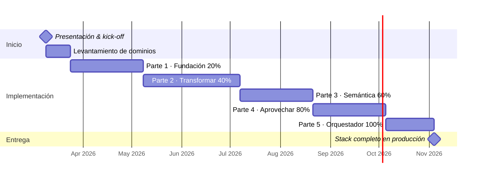

# 🏗️ Modern Data Stack · Azure DaaP

> Arquitectura **Data as a Product** sobre Azure — implementación progresiva en 5 partes.  
> Los protagonistas: **dbt** y **Microsoft Fabric**.

🔗 **Demo:** [lizandro-mc.github.io/modern-data-stack](https://lizandro-mc.github.io/modern-data-stack)  
📁 **Repo:** [github.com/lizandro-mc/modern-data-stack](https://github.com/lizandro-mc/modern-data-stack)

---

## Índice

- [Principios DaaP](#-principios-daap)
- [Vista General del Stack](#-vista-general-del-stack)
- [🟡 dbt — El Protagonista de la Transformación](#-dbt--el-protagonista-de-la-transformación)
- [🟣 Microsoft Fabric — La Plataforma Unificada](#-microsoft-fabric--la-plataforma-unificada)
- [Roadmap de Implementación](#-roadmap-de-implementación)
- [Parte 1 · Fundación](#-parte-1--fundación--20)
- [Parte 2 · Transformar](#-parte-2--transformar--40)
- [Parte 3 · Semántica](#-parte-3--semántica--60)
- [Parte 4 · Aprovechar](#-parte-4--aprovechar--80)
- [Parte 5 · Orquestador](#-parte-5--orquestador--100)
- [Detalle por Capa](#-detalle-por-capa)
- [SCD — Dimensiones que Cambian Lentamente](#-scd--dimensiones-que-cambian-lentamente)
- [Glosario de Términos y Siglas](#-glosario-de-términos-y-siglas)
- [Recursos de Aprendizaje Recomendados](#-recursos-de-aprendizaje-recomendados)
- [Instalación](#-instalación)

---

## 🎯 Principios DaaP

| | Principio | Descripción |
|--|-----------|-------------|
| ⚡ | ELT sobre ETL | Transformar dentro del almacén, no antes de cargar |
| ☁️ | Cloud primero | Stack completo sobre Azure |
| 🔀 | Separación cómputo/almacenamiento | Fabric Lakehouse + Synapse |
| 🧠 | Dato como Feature | Ingeniería de características + Azure ML |
| 💻 | Dato como Software | dbt + Git + CI/CD |
| 🔭 | Confiabilidad Proactiva | Observabilidad, Linaje y Contratos de Datos |
| 🛡️ | Gobernanza Centralizada | Microsoft Purview + Fabric One Governance |
| 💡 | Única Fuente de Verdad | dbt Metrics Layer + Fabric Semantic Model |
| 🤖 | Automatización E2E | ADF + Airflow + dbt Jobs |
| 🧩 | Arquitectura Modular | Best-of-Breed, sin vendor lock-in |

---

## 🗺️ Vista General del Stack

**Eje horizontal — Pipeline ELT:**
```
📥 EXTRAER → 📤 CARGAR → ⚙️ TRANSFORMAR → 💡 SEMÁNTICA → 🚀 APROVECHAR
```

**Eje vertical — Fundaciones transversales:**
```
🗄️  ALMACENAR      → OneLake / Fabric Lakehouse / Delta Lake
🛡️  GOBERNAR       → Purview · Fabric One Governance · dbt Contracts
🔭  OBSERVABILIDAD → Elementary · Fabric Monitoring Hub · Azure Monitor
🤖  ORQUESTADOR    → ADF · dbt Jobs · Apache Airflow
```

---

## 🟡 dbt — El Protagonista de la Transformación

> dbt trata el **SQL como código**: versionado, testeado, documentado y desplegado con los mismos estándares que el software de producción. Es la columna vertebral de la transformación y el gobierno del dato en este stack.

### SQL como Código

dbt convierte cada modelo SQL en una unidad de software:

- **Control de versiones completo** en Git: cada cambio tiene autor, fecha y mensaje
- **Code Review obligatorio** con Pull Request antes de llegar a producción
- **CI/CD nativo**: `dbt test` se ejecuta en cada PR automáticamente
- **Historial de auditoría** completo: quién cambió qué, cuándo y por qué
- **Portabilidad total**: cambiar de Fabric a Snowflake = cambiar solo el adaptador en `profiles.yml`

### Tipos de Tests

| Tipo | Descripción | Dónde se define |
|------|-------------|-----------------|
| **Generic tests** | `unique` · `not_null` · `relationships` · `accepted_values` | `schema.yml` |
| **Singular tests** | SQL custom para reglas de negocio complejas | `tests/` |
| **dbt-expectations** | +50 tests de distribución, rangos y patrones | paquete externo |
| **Data health checks** | Freshness, coverage y anomaly detection | Elementary OSS |

```yaml
# Ejemplo schema.yml — tests + documentación + ownership
models:
  - name: fct_ventas
    description: "Tabla de hechos de ventas. Propietario: equipo_comercial"
    meta:
      owner: equipo_comercial
    columns:
      - name: venta_id
        description: "ID único de la venta"
        tests:
          - unique
          - not_null
      - name: cliente_id
        tests:
          - not_null
          - relationships:
              to: ref('dim_cliente')
              field: cliente_id
```

### Linaje de Datos

- Generado automáticamente desde `ref()` y `source()` en cada modelo
- DAG visual completo en dbt Docs
- Integración con **Microsoft Purview** para linaje end-to-end
- **Impact analysis**: saber qué se rompe antes de hacer un cambio

```
source(crm) → brz_crm__clientes → slv_clientes → dim_cliente → fct_ventas → RPT_Ventas
```

### Gobierno y Contratos

```yaml
# Data Contract declarado en schema.yml
models:
  - name: dim_cliente
    config:
      contract:
        enforced: true       # falla el build si el schema no coincide
    columns:
      - name: cliente_id
        data_type: varchar
        constraints:
          - type: not_null
          - type: unique
```

- **Modelos públicos**: expuestos a otros proyectos/dominios con SLA garantizado
- **Modelos privados**: internos al dominio, sin contrato externo
- **dbt Mesh**: arquitectura multi-proyecto para gobernanza federada por dominio
- **Ownership**: `meta.owner` declarado en cada modelo
- **Diccionario de datos**: `description:` en schema.yml = documentación ejecutable

### Portabilidad — Sin Vendor Lock-in

```yaml
# profiles.yml — solo cambiar el adaptador para cambiar de plataforma
my_project:
  target: prod
  outputs:
    prod:
      type: fabric          # ← cambiar por: snowflake | bigquery | databricks
      server: ...
```

El mismo código SQL funciona sobre Fabric, Snowflake, BigQuery o Databricks.

### Recursos de Aprendizaje

| Recurso | Descripción |
|---------|-------------|
| [dbt Core](https://docs.getdbt.com/docs/core/installation-overview) | Motor OSS, gratis e instalable en cualquier entorno |
| [dbt Cloud](https://docs.getdbt.com/docs/cloud/about-cloud/dbt-cloud-features) | SaaS con IDE, scheduler, CI/CD y alertas |
| [dbt Mesh](https://docs.getdbt.com/docs/collaborate/govern/about-dbt-mesh) | Gobernanza federada multi-proyecto |
| [dbt Semantic Layer](https://docs.getdbt.com/docs/use-dbt-semantic-layer/dbt-sl) | Métricas centralizadas consumibles desde cualquier BI |
| [dbt-fabric adapter](https://docs.getdbt.com/docs/core/connect-data-platform/fabric-setup) | Adaptador oficial para Microsoft Fabric |
| [dbt Data Contracts](https://docs.getdbt.com/docs/collaborate/govern/model-contracts) | Contratos de schema versionados y validados |
| [dbt Docs](https://docs.getdbt.com/docs/collaborate/documentation) | Portal de documentación auto-generado |
| [Elementary OSS](https://docs.elementary-data.com) | Observabilidad nativa de dbt |
| [dbt-expectations](https://github.com/calogica/dbt-expectations) | +50 tests avanzados para dbt |

---

## 🟣 Microsoft Fabric — La Plataforma Unificada

> Microsoft Fabric es la plataforma analítica SaaS unificada de Microsoft: **OneLake, One Security, One Governance, One Monitoring**. Elimina silos de datos con un modelo de pago por uso (F-SKUs) y es el hogar natural de dbt en Azure.

### OneLake — Single Data Lake

```
┌─────────────────────────────────────────────────────┐
│                    OneLake                          │
│  ┌──────────┐  ┌──────────┐  ┌──────────────────┐  │
│  │ Lakehouse│  │Warehouse │  │  Semantic Model  │  │
│  │ (Bronze/ │  │  (Gold)  │  │   (Power BI)     │  │
│  │  Silver) │  │          │  │                  │  │
│  └──────────┘  └──────────┘  └──────────────────┘  │
│         Todos sobre Delta/Parquet abierto            │
└─────────────────────────────────────────────────────┘
```

- **Un solo lago lógico** para toda la organización, múltiples workspaces
- **Zero-copy shortcuts**: acceder a datos externos sin moverlos ni duplicarlos
- **Formato Delta/Parquet abierto**: portable a cualquier plataforma, sin lock-in
- Compatible con ADLS Gen2, S3 y GCS vía shortcuts externos

### One Security & One Governance

- **One Access Control Experience**: permisos unificados para todos los items desde un único panel
- Integración nativa con **Microsoft Purview**: catálogo, linaje y clasificación automática
- Row-level security y column-level security en Warehouse
- Sensitivity labels automáticos desde Purview a todos los datasets
- Audit logs centralizados para cumplimiento normativo (GDPR, SOC2, etc.)

### F-SKUs — Escalabilidad por Dominio

| SKU | CUs | Caso de uso |
|-----|-----|-------------|
| F2  | 2   | Desarrollo y pruebas |
| F4  | 4   | Dominio pequeño en producción |
| F8  | 8   | Dominio mediano, cargas regulares |
| F16+| 16+ | Dominios críticos, alta concurrencia |
| F64+| 64+ | Plataforma enterprise completa |

- **Pagar por uso real**, no por almacenamiento fijo
- **Burst automático** para picos de carga sin aprovisionamiento manual
- Separar capacidades F-SKU por dominio: ventas ≠ finanzas ≠ datos crudos
- **Escalar almacenamiento y cómputo de forma independiente**

### Integración con dbt ← Clave

```
dbt Core/Cloud
      │
      │ dbt-fabric adapter
      ▼
Fabric Warehouse ──── OneLake ──── Fabric Lakehouse
      │                                    │
   Gold / Semántica               Bronze / Silver
```

- **dbt-fabric adapter** oficial: conecta dbt directamente con Fabric Warehouse
- **dbt Jobs** ejecutan sobre Fabric Lakehouse y Warehouse sin infraestructura adicional
- **Linaje dbt visible en Purview**: trazabilidad end-to-end automática
- CI/CD: dbt test en PR → dbt job en stage → dbt job en prod
- OneLake como destino de todos los modelos dbt: Bronze, Silver, Gold

### Herramientas de Fabric para el Stack

| Herramienta | Rol en el stack | Docs |
|-------------|-----------------|------|
| **Lakehouse** | Bronze y Silver sobre Delta Lake | [→](https://learn.microsoft.com/es-es/fabric/data-engineering/lakehouse-overview) |
| **Warehouse** | Gold y capa Semántica con SQL serverless | [→](https://learn.microsoft.com/es-es/fabric/data-warehouse/data-warehousing) |
| **Data Factory** | Ingesta nativa con +150 conectores | [→](https://learn.microsoft.com/es-es/fabric/data-factory/data-factory-overview) |
| **DirectLake** | Power BI lee OneLake sin copiar datos | [→](https://learn.microsoft.com/es-es/fabric/fundamentals/direct-lake-overview) |
| **Notebooks** | PySpark para ML y Feature Engineering | [→](https://learn.microsoft.com/es-es/fabric/data-engineering/how-to-use-notebook) |
| **Monitoring Hub** | Visibilidad unificada de jobs y consumos | [→](https://learn.microsoft.com/es-es/fabric/admin/monitoring-hub) |
| **Real-Time Intelligence** | Streaming y análisis en tiempo real | [→](https://learn.microsoft.com/es-es/fabric/real-time-intelligence/overview) |
| **Semantic Model** | DirectLake desde OneLake a Power BI | [→](https://learn.microsoft.com/es-es/fabric/get-started/microsoft-fabric-overview) |
| **Purview + Fabric** | One Governance para todos los items | [→](https://learn.microsoft.com/es-es/fabric/governance/microsoft-purview-fabric) |
| **F-SKUs / Pricing** | Capacidad flexible por dominio | [→](https://learn.microsoft.com/es-es/fabric/enterprise/licenses) |

### Ambientes en Fabric — Dev / Stage / Prod

```
fabric-dev              fabric-stage            fabric-prod
├── lh_raw_crm          ├── lh_raw_crm          ├── lh_raw_crm
├── lh_bronze_crm       ├── lh_bronze_crm       ├── lh_bronze_crm
├── lh_silver           ├── lh_silver           ├── lh_silver
├── wh_gold             ├── wh_gold             ├── wh_gold
└── sm_ventas           └── sm_ventas           └── sm_ventas
```

- Un **workspace de Fabric por ambiente**: misma estructura, datos separados
- **Zero-copy cloning** para crear entornos de dev sin duplicar datos de prod
- Variables de entorno en dbt (`profiles.yml`) apuntan al workspace correcto
- CI/CD: PR → deploy automático en stage → aprobación manual → prod

### Sin Vendor Lock-in

- Datos en **Delta/Parquet abierto**: legible desde Databricks, Synapse, Spark, etc.
- ADLS Gen2 compatible: accesible desde cualquier herramienta del ecosistema
- Shortcuts: conectar datos externos sin moverlos a OneLake
- dbt como capa portable: cambiar Fabric = cambiar solo el adaptador

---

## 📅 Roadmap de Implementación

> Inicio: **9 de marzo de 2026** · Equipo de 5 personas · Estimado optimista  
> ⚠️ El tiempo real depende del levantamiento de dominios y fuentes de datos.



**Total estimado: 155–225 días hábiles** (marzo → noviembre 2026)

### Hitos y Entregables

| Fecha | Hito | Entregables clave |
|-------|------|-------------------|
| **9 Mar 2026** | Kick-off | Presentación aprobada, equipo formado |
| **24 Mar 2026** | Levantamiento | Dominios mapeados, fuentes identificadas, contratos iniciales |
| **7 May 2026** | Fundación 20% | Workspaces Fabric dev/stage/prod · Lakehouse RAW · Pipelines ADF · Purview inicial · RBAC |
| **7 Jul 2026** | Transformar 40% | dbt Bronze/Silver/Gold · CI/CD · dbt Docs · Elementary · Alertas SLA |
| **21 Ago 2026** | Semántica 60% | dbt Semantic Layer · Fabric Semantic Model · DirectLake · API métricas |
| **5 Oct 2026** | Aprovechar 80% | Power BI dashboards · Azure ML · Feature Store · RAG OpenAI |
| **4 Nov 2026** | 🏁 Producción 100% | DAGs E2E · Monitoring Hub · Runbooks · Stack completo |

---

## 🟦 Parte 1 · Fundación — 20%

**⏱ 30–45 días** · Capas: `EXTRAER` `CARGAR` `ALMACENAR` `GOBERNAR`

> Base mínima viable. Sin esta fundación ninguna capa superior es sostenible.

```
Fuentes (CRM · ERP · APIs)
        ↓
   [ADF · Airbyte]          ← EXTRAER: identificar por sistema, no por dominio
        ↓
  [lh_raw_{sistema}]        ← CARGAR: aterrizaje en Fabric Lakehouse RAW
        ↓
     [OneLake]              ← ALMACENAR: Delta Lake sobre OneLake
        ↕
   [Purview · RBAC]         ← GOBERNAR: catálogo y contratos desde el día 1
```

| Capa | Herramientas |
|------|-------------|
| 📥 EXTRAER | Azure Data Factory · Event Hubs · Airbyte |
| 📤 CARGAR | ADF Copy Activity · Fabric Data Factory · COPY INTO |
| 🗄️ ALMACENAR | Fabric Lakehouse · OneLake · Delta Lake |
| 🛡️ GOBERNAR | Microsoft Purview · Azure Policy · dbt Tests |

---

## 🟠 Parte 2 · Transformar — 40%

**⏱ 45–60 días** · Añade: `TRANSFORMAR` `OBSERVABILIDAD`

> ELT con dbt sobre Fabric. El dato como Software: versionado, testeado y documentado.

```
lh_raw_{sistema}  →  [dbt Bronze]  →  [dbt Silver]  →  [dbt Gold]
                          ↕                 ↕                ↕
                     [Elementary · Azure Monitor · dbt Artifacts]
```

**Arquitectura Medallion con dbt + Fabric:**

| Capa | Lakehouse Item | Modelos dbt | Descripción |
|------|---------------|-------------|-------------|
| Bronze | `lh_bronze_{sistema}` | `brz_{sistema}__{entidad}.sql` | JSON descompuesto, sin transformar |
| Silver | `lh_silver` | `slv_{entidad}.sql` | Limpio, deduplicado, tipado |
| Gold | `wh_gold` | `fct_{hecho}.sql` / `dim_{dim}.sql` | Agregado, listo para consumo |

---

## 🟣 Parte 3 · Semántica — 60%

**⏱ 30–45 días** · Añade: `SEMÁNTICA`

> Una sola definición de métricas para todos los consumidores. dbt + Fabric garantizan consistencia total.

```
Gold (wh_gold)
      ↓
[dbt Semantic Layer]  ←→  [Fabric Semantic Model]
      ↓                           ↓
  REST API                   DirectLake
      ↓                           ↓
  Azure ML                    Power BI
```

**Mejores prácticas dbt + Fabric en la capa semántica:**
- Definir métricas en dbt Semantic Layer como fuente de verdad
- Fabric Semantic Model consume las Gold tables vía DirectLake (cero copia)
- Un Semantic Model por dominio de negocio
- Versionar todas las definiciones en Git junto con los modelos dbt

| Herramienta | Rol |
|-------------|-----|
| dbt Metrics Layer | Define las métricas en YAML versionado |
| Fabric Semantic Model | Expone métricas a Power BI vía DirectLake |
| Power BI Dataset | Compartido entre múltiples reportes |
| Analysis Services | OLAP tabular para modelos complejos |

---

## 🟢 Parte 4 · Aprovechar — 80%

**⏱ 30–45 días** · Añade: `APROVECHAR`

> El dato genera valor: dashboards, modelos ML e IA sobre datos propios. Dato como Feature (DaaF).

```
[Fabric Semantic Model / OneLake]
        ↓              ↓              ↓
   Power BI        Azure ML      Azure OpenAI
 (DirectLake)   (Feature Store)    (RAG)
```

**dbt y Fabric en esta capa:**
- Power BI conecta a **Fabric Semantic Model via DirectLake** — cero latencia, cero copia
- Las Gold tables de dbt alimentan directamente el **Feature Store de Azure ML**
- **Fabric Notebooks** (PySpark) para Feature Engineering sobre OneLake
- RAG con Azure OpenAI + Azure AI Search indexando datos del Lakehouse

**Mejores prácticas:**
- Power BI conecta SIEMPRE al Semantic Model, nunca a tablas crudas
- Feature Store centralizado para consistencia entrenamiento/inferencia
- Versionar modelos ML con MLflow en Azure ML Workspace
- Monitorear drift de datos y modelos como parte de Observabilidad

---

## 🟡 Parte 5 · Orquestador — 100%

**⏱ 20–30 días** · Añade: `ORQUESTADOR`

> El orquestador conecta todo el stack de extremo a extremo.

```
[ADF]  →  EXTRAER → CARGAR
[dbt Jobs on Fabric]  →  TRANSFORMAR → SEMÁNTICA
[Airflow DAGs]  →  coordina dependencias entre etapas
[Fabric Monitoring Hub]  →  visibilidad unificada
```

| Herramienta | Responsabilidad |
|-------------|-----------------|
| Azure Data Factory | Orquesta ingesta y pipelines de carga |
| dbt Jobs (Fabric) | Ejecuta transformaciones Bronze→Silver→Gold |
| Apache Airflow | DAGs complejos con dependencias entre dominios |
| Fabric Monitoring Hub | Visibilidad unificada de todos los jobs |

---

## 📚 Detalle por Capa

### 📥 EXTRAER

> Ingesta desde fuentes heterogéneas. Identificar por sistema origen, no por dominio de negocio.

**Mejores prácticas**
- Identificar fuentes por **sistema origen** (CRM, ERP, API) — no por dominio de negocio
- Nunca transformar en extracción — Schema-on-Read estricto
- Registrar metadatos por cada ingesta (timestamp, volumen, estado)
- CDC para capturar solo cambios incrementales
- Reintentos automáticos ante fallos de conexión

**Nomenclatura**
```
Carpetas:    raw/{sistema_origen}/{entidad}/año=YYYY/mes=MM/día=DD/
Archivos:    {sistema}_{entidad}_{timestamp}.parquet
Pipelines:   pl_{sistema}_{entidad}_{tipo}
             ej. pl_crm_clientes_full · pl_erp_pedidos_cdc
```

**Herramientas**

| Herramienta | Descripción | Docs |
|-------------|-------------|------|
| Azure Data Factory | +90 conectores nativos gestionados | [→](https://learn.microsoft.com/es-es/azure/data-factory/introduction) |
| Fabric Data Factory | Pipelines nativos de Fabric con +150 conectores | [→](https://learn.microsoft.com/es-es/fabric/data-factory/data-factory-overview) |
| Azure Event Hubs | Streaming Kafka-compatible | [→](https://learn.microsoft.com/es-es/azure/event-hubs/event-hubs-about) |
| Airbyte OSS | +300 conectores open-source sin vendor lock-in | [→](https://docs.airbyte.com) |

---

### 📤 CARGAR

> Aterrizaje de datos crudos al Lakehouse de Fabric. JSON llegan intactos — dbt los descompone en Bronze.

**Patrón ELT — JSON intactos**

```
API externa → JSON raw → lh_raw_{sistema} → (dbt Bronze descompone)
                ↑
         NO tocar aquí
         Llega intacto
```

**Metadata obligatoria — Nunca cargar sin marcar**

```sql
-- Columnas obligatorias en TODA tabla raw
_ingested_at      TIMESTAMP  -- momento exacto de carga UTC
_source_system    STRING     -- sistema origen: crm | erp | api_pagos
_source_entity    STRING     -- entidad/tabla/endpoint origen
_source_file      STRING     -- ruta o nombre del archivo fuente
_batch_id         STRING     -- ID único de la ejecución del pipeline
_raw_hash         STRING     -- hash MD5/SHA del registro para deduplicación
_pipeline_name    STRING     -- nombre del pipeline ADF
_is_deleted       BOOLEAN    -- flag CDC para eliminaciones lógicas
```

**Nomenclatura de Lakehouse Items en Fabric**
```
Lakehouse RAW:   lh_raw_{sistema}      ej. lh_raw_crm · lh_raw_erp
Tablas raw:      raw__{sistema}__{entidad}
                 ej. raw__crm__clientes · raw__erp__pedidos
Workspaces:      {org}-fabric-dev · {org}-fabric-stage · {org}-fabric-prod
Pipelines ADF:   pl_load_{sistema}_{entidad}_{frecuencia}
```

**Herramientas**

| Herramienta | Descripción | Docs |
|-------------|-------------|------|
| ADF Copy Activity | Carga masiva con metadata de auditoría automática | [→](https://learn.microsoft.com/es-es/azure/data-factory/copy-activity-overview) |
| Fabric Lakehouse (RAW) | Item Fabric para aterrizaje sobre OneLake | [→](https://learn.microsoft.com/es-es/fabric/data-engineering/lakehouse-overview) |
| COPY INTO | Carga masiva SQL nativa desde OneLake | [→](https://learn.microsoft.com/es-es/sql/t-sql/statements/copy-into-transact-sql) |
| dbt Seeds | Catálogos y datos de referencia en Git | [→](https://docs.getdbt.com/docs/build/seeds) |

---

### ⚙️ TRANSFORMAR

> ELT con dbt sobre Fabric. SQL como código: versionado, testeado, documentado, desplegado.

**Mejores prácticas**
- dbt descompone JSON raw en Bronze — nunca en la carga
- Medallion: Bronze (raw descompuesto) → Silver (limpio) → Gold (negocio)
- Tests en cada modelo: `unique`, `not_null`, `relationships`, `accepted_values`
- Documentar en `schema.yml` — la documentación es código ejecutable
- CI/CD: `dbt test` en cada PR, `dbt run` solo tras tests verdes
- dbt Mesh para separar proyectos por dominio con contratos de interfaz

**Nomenclatura dbt + Fabric**
```
Bronze: brz_{sistema}__{entidad}.sql     ej. brz_crm__clientes.sql
Silver: slv_{entidad}.sql                ej. slv_clientes.sql
Gold:   fct_{hecho}.sql                  ej. fct_ventas.sql
        dim_{dimension}.sql              ej. dim_cliente.sql
Schemas Fabric: bronze · silver · gold
Tags dbt:       daily · weekly · critical · pii
```

**Herramientas**

| Herramienta | Descripción | Docs |
|-------------|-------------|------|
| dbt Core / Cloud | Transformación SQL con tests, docs y CI/CD | [→](https://docs.getdbt.com) |
| dbt-fabric adapter | Conecta dbt con Fabric Warehouse y Lakehouse | [→](https://docs.getdbt.com/docs/core/connect-data-platform/fabric-setup) |
| Azure Databricks | Spark para transformaciones complejas sobre OneLake | [→](https://learn.microsoft.com/es-es/azure/databricks/introduction/) |
| dbt-expectations | +50 tests de calidad avanzados | [→](https://github.com/calogica/dbt-expectations) |

---

### 💡 SEMÁNTICA

> Una definición de negocio, múltiples consumidores. dbt + Fabric = Única Fuente de Verdad.

**Herramientas**

| Herramienta | Descripción | Docs |
|-------------|-------------|------|
| dbt Semantic Layer | Métricas en YAML versionadas y portables | [→](https://docs.getdbt.com/docs/use-dbt-semantic-layer/dbt-sl) |
| Fabric Semantic Model | DirectLake desde OneLake a Power BI | [→](https://learn.microsoft.com/es-es/fabric/get-started/microsoft-fabric-overview) |
| Power BI DirectLake | Consulta OneLake sin copiar datos | [→](https://learn.microsoft.com/es-es/fabric/fundamentals/direct-lake-overview) |
| Analysis Services | OLAP tabular para modelos semánticos complejos | [→](https://learn.microsoft.com/es-es/azure/analysis-services/analysis-services-overview) |

---

### 🚀 APROVECHAR

> El dato genera valor: BI, ML, IA Generativa, Feature Engineering. Dato como Feature (DaaF).

**Herramientas**

| Herramienta | Descripción | Docs |
|-------------|-------------|------|
| Power BI + DirectLake | BI líder con consulta directa sobre OneLake | [→](https://learn.microsoft.com/es-es/power-bi/fundamentals/power-bi-overview) |
| Azure Machine Learning | MLOps: entrenamiento, registro y despliegue | [→](https://learn.microsoft.com/es-es/azure/machine-learning/overview-what-is-azure-machine-learning) |
| Fabric Notebooks | PySpark integrado en Fabric para ML | [→](https://learn.microsoft.com/es-es/fabric/data-engineering/how-to-use-notebook) |
| Azure OpenAI Service | GPT-4o y embeddings sobre datos propios (RAG) | [→](https://learn.microsoft.com/es-es/azure/ai-services/openai/overview) |
| MLflow en Azure ML | Tracking y versionado del ciclo de vida ML | [→](https://learn.microsoft.com/es-es/azure/machine-learning/concept-mlflow) |

---

### 🗄️ ALMACENAR

**Herramientas**

| Herramienta | Descripción | Docs |
|-------------|-------------|------|
| Fabric Lakehouse | Bronze y Silver sobre Delta Lake en OneLake | [→](https://learn.microsoft.com/es-es/fabric/data-engineering/lakehouse-overview) |
| Fabric Warehouse | Gold y Semántica con SQL serverless | [→](https://learn.microsoft.com/es-es/fabric/data-warehouse/data-warehousing) |
| OneLake | Single Data Lake para toda la organización | [→](https://learn.microsoft.com/es-es/fabric/onelake/onelake-overview) |
| Delta Lake | ACID + time travel sobre Parquet abierto | [→](https://docs.delta.io/latest/index.html) |

---

### 🛡️ GOBERNAR

**RBAC — Matriz de Acceso por Capa**

| Capa | DataOwner | DataEngineer | DataReader | MLEngineer |
|------|-----------|--------------|------------|------------|
| Raw Lakehouse | ✅ | ✅ | ❌ | ❌ |
| Bronze | ✅ | ✅ | ❌ | ❌ |
| Silver | ✅ | ✅ | ❌ | ✅ |
| Gold | ✅ | ✅ | ✅ lectura | ✅ |
| Semantic Model | ✅ | ✅ | ✅ lectura | ✅ |
| Power BI Reports | ✅ | ✅ | ✅ | ✅ |

**Herramientas**

| Herramienta | Descripción | Docs |
|-------------|-------------|------|
| Microsoft Purview | Catálogo, linaje y clasificación integrado con Fabric | [→](https://learn.microsoft.com/es-es/purview/purview) |
| Fabric One Access Control | Permisos unificados para todos los items de Fabric | [→](https://learn.microsoft.com/es-es/fabric/security/permission-model) |
| dbt Tests + Contracts | Tests YAML como contratos ejecutables | [→](https://docs.getdbt.com/docs/build/data-tests) |
| Azure Policy | Políticas de cumplimiento a escala para Azure | [→](https://learn.microsoft.com/es-es/azure/governance/policy/overview) |

---

### 🔭 OBSERVABILIDAD

**Herramientas**

| Herramienta | Descripción | Docs |
|-------------|-------------|------|
| Fabric Monitoring Hub | Centro unificado de monitoreo de todos los jobs Fabric | [→](https://learn.microsoft.com/es-es/fabric/admin/monitoring-hub) |
| Elementary OSS | Observabilidad nativa de dbt: anomalías y freshness | [→](https://docs.elementary-data.com) |
| Azure Monitor | Métricas, logs y alertas para toda la plataforma | [→](https://learn.microsoft.com/es-es/azure/azure-monitor/overview) |
| dbt Artifacts & Docs | Metadatos de ejecución y docs auto-generados | [→](https://docs.getdbt.com/reference/artifacts/dbt-artifacts) |

---

### 🤖 ORQUESTADOR

**Herramientas**

| Herramienta | Descripción | Docs |
|-------------|-------------|------|
| Azure Data Factory | Orquestador visual para ingesta E2E | [→](https://learn.microsoft.com/es-es/azure/data-factory/concepts-pipelines-activities) |
| dbt Jobs on Fabric | Transformaciones directo sobre Fabric | [→](https://docs.getdbt.com/docs/deploy/job-settings) |
| Apache Airflow | DAGs Python para orquestación compleja | [→](https://airflow.apache.org/docs/) |
| Fabric Data Pipelines | Pipelines nativos integrados con OneLake | [→](https://learn.microsoft.com/es-es/fabric/data-factory/data-factory-overview) |

---

## 🔄 SCD — Dimensiones que Cambian Lentamente

> Las **Slowly Changing Dimensions (SCD)** son el patrón para manejar cambios históricos en las tablas dimensionales (clientes, productos, empleados). Elegir el tipo correcto define cómo el Warehouse preserva o sobreescribe el historial.

### Comparativa de Tipos SCD

| Tipo | Nombre | Comportamiento | Cuándo usarlo | Ejemplo |
|------|--------|----------------|---------------|---------|
| **SCD 0** | Fija | No se actualiza jamás | Datos inmutables por definición | País de nacimiento |
| **SCD 1** | Sobreescribir | Reemplaza el valor antiguo, sin historial | El pasado no importa | Corrección de errores tipográficos |
| **SCD 2** | Historial completo | Nueva fila por cada cambio, con fechas de vigencia | Historial completo requerido | Segmento de cliente, precio de producto |
| **SCD 3** | Valor anterior | Columna adicional con el valor previo | Solo interesa el cambio más reciente | Dirección actual vs. dirección anterior |
| **SCD 4** | Tabla historial | Tabla separada para el historial | Dimensión muy grande con pocos cambios | Historial de precios |
| **SCD 6** | Híbrido (1+2+3) | Combina tipos 1, 2 y 3 | Necesitas historial Y conveniencia de acceso actual | Análisis de cohortes complejos |

### SCD Tipo 2 — El más usado (implementación con dbt)

Es el estándar en la mayoría de los Data Warehouses. Cada cambio genera una nueva fila, conservando el historial completo mediante columnas de vigencia.

```sql
-- dim_cliente con SCD Tipo 2
-- Una fila por versión del cliente, con fechas de vigencia
SELECT
    {{ dbt_utils.generate_surrogate_key(['cliente_id', 'valid_from']) }} AS sk_cliente,
    cliente_id,
    nombre,
    email,
    segmento,
    region,
    valid_from,                            -- fecha desde la que aplica este registro
    COALESCE(valid_to, '9999-12-31') AS valid_to, -- NULL = registro activo
    is_current                             -- TRUE = versión vigente
FROM slv_clientes
```

**Columnas clave en SCD 2:**

| Columna | Tipo | Descripción |
|---------|------|-------------|
| `sk_{dimension}` | VARCHAR | Surrogate key: clave única por versión (no por entidad) |
| `{dimension}_id` | VARCHAR | Clave de negocio original del sistema fuente |
| `valid_from` | TIMESTAMP | Fecha de inicio de vigencia de esta versión |
| `valid_to` | TIMESTAMP | Fecha de fin (NULL o 9999-12-31 = registro activo) |
| `is_current` | BOOLEAN | TRUE si es la versión vigente en este momento |

**Implementación con dbt snapshots:**

```yaml
# snapshots/snp_clientes.yml
snapshots:
  - name: snp_clientes
    relation: source('crm', 'clientes')
    config:
      strategy: timestamp          # o 'check' para comparar columnas específicas
      unique_key: cliente_id
      updated_at: updated_at
      invalidate_hard_deletes: true
```

```sql
-- snapshots/snp_clientes.sql

  {{
    config(
      target_schema='snapshots',
      unique_key='cliente_id',
      strategy='timestamp',
      updated_at='updated_at',
    )
  }}
  SELECT * FROM {{ source('crm', 'clientes') }}

```

**Luego la dimensión consume el snapshot:**

```sql
-- models/gold/dimensions/dim_cliente.sql
SELECT
    {{ dbt_utils.generate_surrogate_key(['cliente_id', 'dbt_valid_from']) }} AS sk_cliente,
    cliente_id,
    nombre,
    segmento,
    region,
    dbt_valid_from   AS valid_from,
    dbt_valid_to     AS valid_to,
    (dbt_valid_to IS NULL) AS is_current
FROM {{ ref('snp_clientes') }}
```

### SCD Tipo 1 — Sobreescribir (el más simple)

```sql
-- models/gold/dimensions/dim_producto.sql
-- SCD 1: siempre refleja el estado actual, sin historial
SELECT
    producto_id,
    nombre,
    categoria,      -- si cambia, simplemente se actualiza
    precio_actual   -- idem
FROM {{ ref('slv_productos') }}
```

### Elegir el Tipo Correcto

```
¿Necesitas historial?
    ├── NO → SCD 1 (sobreescribir)
    └── SÍ → ¿Es inmutable el dato?
              ├── SÍ → SCD 0 (fija)
              └── NO → ¿Cuántos cambios históricos?
                        ├── Solo el anterior → SCD 3
                        ├── Historial completo → SCD 2 ← el más común
                        └── Dimensión enorme → SCD 4 (tabla historial)
```

### Recursos SCD

| Recurso | Descripción |
|---------|-------------|
| [dbt Snapshots](https://docs.getdbt.com/docs/build/snapshots) | Implementación nativa de SCD 2 con dbt |
| [dbt_utils.generate_surrogate_key](https://github.com/dbt-labs/dbt-utils#generate_surrogate_key-source) | Macro para generar surrogate keys |
| [Kimball — The Data Warehouse Toolkit](https://www.kimballgroup.com/data-warehouse-business-intelligence-resources/kimball-techniques/dimensional-modeling-techniques/slowly-changing-dimensions/) | Referencia original de SCDs |

---

## 📖 Glosario de Términos y Siglas

> Todos los acrónimos y conceptos técnicos de este stack, con su expansión y referencia oficial.

| Sigla / Término | Expansión | Descripción | Docs |
|-----------------|-----------|-------------|------|
| **ACID** | Atomicity, Consistency, Isolation, Durability | Las 4 propiedades que garantizan transacciones confiables. Delta Lake implementa ACID sobre Parquet. | [→](https://docs.delta.io/latest/concurrency-control.html) |
| **ADF** | Azure Data Factory | Servicio de orquestación e integración de datos de Azure. +90 conectores nativos. | [→](https://learn.microsoft.com/es-es/azure/data-factory/introduction) |
| **ADLS Gen2** | Azure Data Lake Storage Generation 2 | Almacenamiento jerárquico de Azure optimizado para analítica. Base física de OneLake. | [→](https://learn.microsoft.com/es-es/azure/storage/blobs/data-lake-storage-introduction) |
| **API** | Application Programming Interface | Interfaz para comunicar sistemas. Se usa para consumir la capa semántica externamente. | [→](https://learn.microsoft.com/es-es/azure/architecture/best-practices/api-design) |
| **BI** | Business Intelligence | Tecnologías para analizar datos de negocio. Power BI es la herramienta principal de este stack. | [→](https://learn.microsoft.com/es-es/power-bi/fundamentals/power-bi-overview) |
| **CAP** | Consistency, Availability, Partition Tolerance | Teorema: un sistema distribuido solo garantiza 2 de 3 propiedades. Explica OLTP vs OLAP. | [→](https://www.ibm.com/topics/cap-theorem) |
| **CDC** | Change Data Capture | Captura solo los cambios (inserciones, actualizaciones, eliminaciones) en el origen. Reduce carga hasta un 90%. | [→](https://learn.microsoft.com/es-es/azure/data-factory/concepts-change-data-capture) |
| **CI/CD** | Continuous Integration / Continuous Delivery | Automatiza integración y despliegue de código. En dbt: cada PR ejecuta `dbt test` antes de merge. | [→](https://docs.getdbt.com/docs/deploy/continuous-integration) |
| **DaaF** | Data as a Feature | Los datos son features de ML, preparados con la misma rigurosidad que cualquier feature de software. | [→](https://learn.microsoft.com/es-es/azure/machine-learning/concept-data) |
| **DaaP** | Data as a Product | Los datasets son tratados como productos: con propietario, docs, tests, SLA y usuarios. | [→](https://martinfowler.com/articles/data-mesh-principles.html) |
| **DAG** | Directed Acyclic Graph | Grafo de dependencias entre tareas. En Airflow define el orden de ejecución. En dbt es el linaje. | [→](https://airflow.apache.org/docs/apache-airflow/stable/concepts/dags.html) |
| **dbt** | Data Build Tool | Transforma SQL como código: versionado, testeado, documentado y desplegado con CI/CD. | [→](https://docs.getdbt.com/docs/introduction) |
| **Delta Lake** | Delta Lake (formato abierto) | Añade ACID, time travel y schema enforcement sobre Parquet. Formato base de OneLake y Fabric. | [→](https://docs.delta.io/latest/index.html) |
| **DirectLake** | DirectLake (modo Power BI en Fabric) | Power BI consulta directamente Delta en OneLake sin importar ni copiar datos. | [→](https://learn.microsoft.com/es-es/fabric/fundamentals/direct-lake-overview) |
| **DW** | Data Warehouse | Base de datos OLAP para consultas analíticas. En este stack: Fabric Warehouse para la capa Gold. | [→](https://learn.microsoft.com/es-es/fabric/data-warehouse/data-warehousing) |
| **ELT** | Extract, Load, Transform | Cargar primero al almacén cloud y transformar después dentro del motor. Opuesto a ETL. | [→](https://learn.microsoft.com/es-es/azure/architecture/data-guide/relational-data/etl) |
| **ETL** | Extract, Transform, Load | Patrón tradicional: transformar antes de cargar. Este stack usa ELT en su lugar. | [→](https://learn.microsoft.com/es-es/azure/architecture/data-guide/relational-data/etl) |
| **F-SKU** | Fabric Stock Keeping Unit | Unidad de capacidad de cómputo en Microsoft Fabric, medida en CUs. Escalable por demanda real. | [→](https://learn.microsoft.com/es-es/fabric/enterprise/licenses) |
| **GDPR** | General Data Protection Regulation | Regulación EU sobre datos personales. Aplica si se procesan datos de ciudadanos europeos. | [→](https://gdpr.eu/) |
| **KPI** | Key Performance Indicator | Métrica cuantificable de rendimiento de negocio. Se define una vez en la capa semántica. | [→](https://docs.getdbt.com/docs/build/metrics-overview) |
| **Medallion** | Arquitectura Medallion (Bronze/Silver/Gold) | Patrón de tres capas: Bronze (crudo), Silver (limpio), Gold (agregado para consumo). | [→](https://learn.microsoft.com/es-es/azure/databricks/lakehouse/medallion) |
| **ML** | Machine Learning | Sistemas que aprenden de datos. Azure Machine Learning es la plataforma MLOps del stack. | [→](https://learn.microsoft.com/es-es/azure/machine-learning/overview-what-is-azure-machine-learning) |
| **MLOps** | Machine Learning Operations | Prácticas DevOps aplicadas al ciclo de vida de modelos ML: entrena, registra, despliega, monitorea. | [→](https://learn.microsoft.com/es-es/azure/machine-learning/concept-model-management-and-deployment) |
| **MPP** | Massively Parallel Processing | Arquitectura que distribuye consultas entre nodos para procesarlas en paralelo a escala de petabytes. | [→](https://learn.microsoft.com/es-es/azure/synapse-analytics/sql-data-warehouse/massively-parallel-processing-mpp-architecture) |
| **OLAP** | Online Analytical Processing | Bases de datos para análisis de grandes volúmenes históricos. Fabric Warehouse y Lakehouse son OLAP. | [→](https://learn.microsoft.com/es-es/azure/architecture/data-guide/relational-data/online-analytical-processing) |
| **OLTP** | Online Transaction Processing | Bases de datos operacionales (CRM, ERP). Optimizadas para escrituras rápidas, no para análisis. | [→](https://learn.microsoft.com/es-es/azure/architecture/data-guide/relational-data/online-transaction-processing) |
| **OneLake** | OneLake (Microsoft Fabric) | Único data lake lógico de Fabric. Basado en ADLS Gen2, con formato Delta/Parquet abierto. | [→](https://learn.microsoft.com/es-es/fabric/onelake/onelake-overview) |
| **OSS** | Open Source Software | Código fuente público. En este stack: dbt Core, Airbyte, Elementary, Airflow. | [→](https://opensource.org/osd) |
| **Parquet** | Apache Parquet (formato columnar) | Formato columnar optimizado para análisis. Base de Delta Lake. Más rápido y compacto que CSV. | [→](https://parquet.apache.org/docs/) |
| **PII** | Personally Identifiable Information | Datos que identifican a una persona: nombre, email, CURP. Requiere clasificación y protección especial. | [→](https://learn.microsoft.com/es-es/purview/sensitivity-labels) |
| **PR** | Pull Request | Mecanismo Git para proponer cambios. En dbt, todo cambio a Gold o métricas requiere PR con revisión. | [→](https://docs.github.com/es/pull-requests) |
| **RAG** | Retrieval Augmented Generation | IA que combina LLM con búsqueda sobre datos propios para respuestas contextualizadas. | [→](https://learn.microsoft.com/es-es/azure/search/retrieval-augmented-generation-overview) |
| **RBAC** | Role-Based Access Control | Permisos asignados a roles, no a personas. Simplifica gestión de acceso y aplica mínimo privilegio. | [→](https://learn.microsoft.com/es-es/fabric/security/permission-model) |
| **REST** | Representational State Transfer | Estilo arquitectónico para APIs web. La capa semántica se expone vía API REST. | [→](https://learn.microsoft.com/es-es/azure/architecture/best-practices/api-design) |
| **SCD** | Slowly Changing Dimension | Patrón para manejar cambios históricos en dimensiones (clientes, productos). Ver sección SCD. | [→](https://docs.getdbt.com/docs/build/snapshots) |
| **Schema-on-Read** | Schema-on-Read (Esquema en Lectura) | Datos almacenados sin estructura impuesta; el esquema se aplica al leerlos. Usado en RAW/Bronze. | [→](https://docs.delta.io/latest/schema-validation.html) |
| **SLA** | Service Level Agreement | Compromiso de disponibilidad, frescura o calidad de un dato. Se monitorea con Elementary y Azure Monitor. | [→](https://learn.microsoft.com/es-es/azure/azure-monitor/alerts/alerts-overview) |
| **SOC 2** | Service Organization Control 2 | Estándar de auditoría de seguridad cloud. Fabric y Azure tienen certificación SOC 2 Tipo II. | [→](https://learn.microsoft.com/es-es/azure/compliance/offerings/offering-soc-2) |
| **SQL** | Structured Query Language | Lenguaje estándar para bases de datos relacionales. dbt usa SQL para todos los modelos. | [→](https://docs.getdbt.com/docs/core/connect-data-platform/about-core-connections) |
| **Zero-copy** | Zero-copy (clonación sin duplicar datos) | Shortcut/referencia a datos en lugar de duplicarlos. OneLake usa zero-copy entre servicios. | [→](https://learn.microsoft.com/es-es/fabric/onelake/onelake-shortcuts) |

---

## 📚 Recursos de Aprendizaje Recomendados

### Fundamentos del Stack

| Recurso | Tipo | Descripción |
|---------|------|-------------|
| [The Data Warehouse Toolkit — Kimball](https://www.kimballgroup.com/data-warehouse-business-intelligence-resources/) | 📘 Libro | La referencia canónica de modelado dimensional: hechos, dimensiones y SCDs |
| [Data Mesh Principles — Martin Fowler](https://martinfowler.com/articles/data-mesh-principles.html) | 📄 Artículo | Principios fundacionales de DaaP y Data Mesh |
| [Fundamentals of Data Engineering — O'Reilly](https://www.oreilly.com/library/view/fundamentals-of-data/9781098108298/) | 📘 Libro | Referencia completa del ciclo de vida de ingeniería de datos |
| [The Analytics Engineering Guide — dbt Labs](https://www.getdbt.com/analytics-engineering/) | 📄 Guía | Qué es Analytics Engineering y cómo dbt lo implementa |

### dbt

| Recurso | Descripción |
|---------|-------------|
| [dbt Learn (cursos oficiales)](https://learn.getdbt.com/) | Cursos gratuitos de dbt Labs: fundamentos, Jinja, tests, Mesh |
| [dbt Best Practices](https://docs.getdbt.com/best-practices) | Guías oficiales: estructura de proyectos, Medallion, naming |
| [dbt Discourse (comunidad)](https://discourse.getdbt.com/) | Foro de la comunidad dbt: preguntas, patrones y casos de uso |
| [dbt Slack](https://www.getdbt.com/community/join-the-community/) | Comunidad activa en Slack: +50.000 miembros |
| [dbt Snapshots (SCD 2)](https://docs.getdbt.com/docs/build/snapshots) | Implementación oficial de SCD 2 con dbt |
| [dbt MetricFlow](https://docs.getdbt.com/docs/build/about-metricflow) | Motor de métricas semánticas en dbt |

### Microsoft Fabric

| Recurso | Descripción |
|---------|-------------|
| [Microsoft Fabric Learn](https://learn.microsoft.com/es-es/training/browse/?products=fabric) | Módulos de aprendizaje oficial gratuitos de Fabric |
| [Fabric Community](https://community.fabric.microsoft.com/) | Foro oficial de la comunidad de Microsoft Fabric |
| [Fabric Updates Blog](https://blog.fabric.microsoft.com/) | Blog oficial con novedades y actualizaciones del producto |
| [Fabric Notes (Guy in a Cube)](https://www.youtube.com/@GuyInACube) | Canal de YouTube con tutoriales prácticos de Fabric y Power BI |
| [Lakehouse vs Warehouse en Fabric](https://learn.microsoft.com/es-es/fabric/data-engineering/lakehouse-vs-data-warehouse) | Cuándo usar Lakehouse y cuándo usar Warehouse |
| [Fabric Capacity Planning](https://learn.microsoft.com/es-es/fabric/enterprise/plan-capacity) | Guía para estimar y planificar F-SKUs por carga de trabajo |

### Azure & DevOps

| Recurso | Descripción |
|---------|-------------|
| [Azure Data Architecture Guide](https://learn.microsoft.com/es-es/azure/architecture/data-guide/) | Patrones de arquitectura de datos en Azure (ELT, Lambda, Kappa) |
| [Azure Well-Architected Framework](https://learn.microsoft.com/es-es/azure/well-architected/) | Pilares de excelencia: fiabilidad, seguridad, eficiencia, costos |
| [GitHub Actions para dbt CI/CD](https://docs.getdbt.com/docs/deploy/continuous-integration) | Cómo configurar CI/CD de dbt con GitHub Actions |
| [Fabric Git Integration](https://learn.microsoft.com/es-es/fabric/cicd/git-integration/intro-to-git-integration) | Control de versiones Git nativo en Microsoft Fabric |

### Modelado Dimensional & SCDs

| Recurso | Descripción |
|---------|-------------|
| [Kimball Group — SCD Techniques](https://www.kimballgroup.com/data-warehouse-business-intelligence-resources/kimball-techniques/dimensional-modeling-techniques/slowly-changing-dimensions/) | Referencia original de todos los tipos de SCD |
| [dbt Snapshots Guide](https://docs.getdbt.com/docs/build/snapshots) | SCD 2 nativo con dbt: strategies timestamp y check |
| [dbt_utils — surrogate_key](https://github.com/dbt-labs/dbt-utils#generate_surrogate_key-source) | Macro para generar surrogate keys consistentes en dimensiones |
| [Star Schema vs Data Vault](https://www.databricks.com/glossary/data-vault) | Cuándo usar estrella vs Data Vault para el Gold layer |

### Gobernanza & Calidad de Datos

| Recurso | Descripción |
|---------|-------------|
| [Microsoft Purview Docs](https://learn.microsoft.com/es-es/purview/) | Documentación completa de catálogo, linaje y clasificación |
| [DAMA-DMBOK (Data Management)](https://www.dama.org/cpages/body-of-knowledge) | Cuerpo de conocimiento estándar de gestión de datos |
| [Great Expectations Docs](https://docs.greatexpectations.io/) | Framework OSS para validación de calidad de datos |
| [Monte Carlo — Data Observability](https://www.montecarlodata.com/blog-what-is-data-observability/) | Qué es la observabilidad de datos y sus 5 pilares |

---

## 🚀 Instalación

```bash
git clone https://github.com/lizandro-mc/modern-data-stack.git
cd modern-data-stack
npm install
npm run dev        # → localhost:5173/modern-data-stack/
npm run deploy     # → GitHub Pages
```

Cada `git push` a `main` despliega automáticamente vía GitHub Actions.

### Estructura del proyecto
```
src/
├── data/
│   ├── blockData.js      ← contenido de capas + dbt + Fabric
│   ├── partsConfig.js    ← partes + roadmap con hitos y entregables
│   ├── objectives.js     ← principios DaaP
│   └── glossary.js       ← glosario de términos y siglas
├── components/
│   ├── Header.jsx
│   ├── NavParts.jsx
│   ├── DiagramPart.jsx
│   ├── BlockDetail.jsx
│   ├── ProtagonistDetail.jsx  ← páginas dbt y Fabric
│   ├── ProgressCard.jsx
│   ├── RoadmapView.jsx        ← roadmap visual con entregables
│   ├── GlossaryView.jsx       ← glosario con búsqueda
│   ├── ToolsGrid.jsx
│   └── Tooltip.jsx
└── App.jsx                    ← tabs: Stack · dbt · Fabric · Roadmap · Glosario
```

### Cómo editar contenido

| Qué cambiar | Dónde |
|-------------|-------|
| Herramientas / prácticas dbt | `src/data/blockData.js` → `DBT` |
| Herramientas / prácticas Fabric | `src/data/blockData.js` → `FABRIC` |
| Capas del pipeline | `src/data/blockData.js` → bloque correspondiente |
| Hitos del roadmap | `src/data/partsConfig.js` → `ROADMAP` |
| Entregables por fase | `src/components/RoadmapView.jsx` → `PARTS_INFO` |
| Principios DaaP | `src/data/objectives.js` |
| Términos del glosario | `src/data/glossary.js` |

---

<div align="center">
  <strong>Modern Data Stack · Azure DaaP · dbt + Microsoft Fabric</strong><br/>
  <a href="https://lizandro-mc.github.io/modern-data-stack">lizandro-mc.github.io/modern-data-stack</a>
</div>