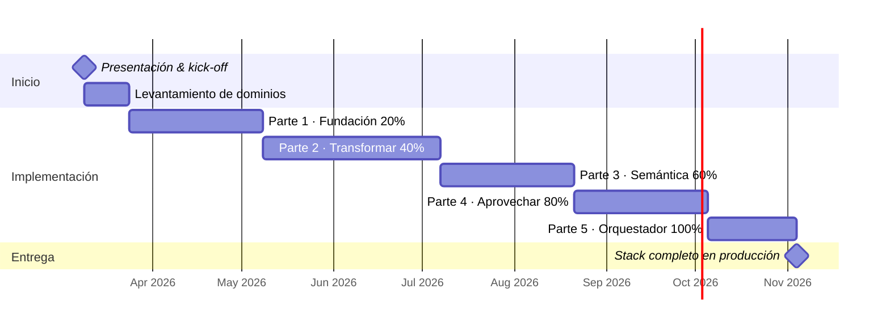

# 🏗️ Modern Data Stack · Azure DaaP · Banca

> Arquitectura **Data as a Product** sobre Azure — implementación progresiva en 5 partes.  
> Optimizada para **analítica bancaria**: riesgo, cumplimiento, fraude, tesorería y canales digitales.  
> Los protagonistas: **dbt** y **Microsoft Fabric**.

🔗 **Demo:** [lizandro-mc.github.io/modern-data-stack](https://lizandro-mc.github.io/modern-data-stack)  
📁 **Repo:** [github.com/lizandro-mc/modern-data-stack](https://github.com/lizandro-mc/modern-data-stack)

---

## Índice

- [Principios DaaP](#-principios-daap)
- [Vista General del Stack](#-vista-general-del-stack)
- [🏦 Caso de Uso Bancario](#-caso-de-uso-bancario)
- [🚚 Migración On-Premise → Azure](#-migración-on-premise--azure)
- [🟡 dbt — El Protagonista de la Transformación](#-dbt--el-protagonista-de-la-transformación)
- [🟣 Microsoft Fabric — La Plataforma Unificada](#-microsoft-fabric--la-plataforma-unificada)
- [📅 Roadmap de Implementación](#-roadmap-de-implementación)
- [Parte 1 · Fundación](#-parte-1--fundación--20)
- [Parte 2 · Transformar](#-parte-2--transformar--40)
- [Parte 3 · Semántica](#-parte-3--semántica--60)
- [Parte 4 · Aprovechar](#-parte-4--aprovechar--80)
- [Parte 5 · Orquestador](#-parte-5--orquestador--100)
- [Detalle por Capa](#-detalle-por-capa)
- [🔄 SCD — Dimensiones que Cambian Lentamente](#-scd--dimensiones-que-cambian-lentamente)
- [📖 Glosario](#-glosario-de-términos-y-siglas)
- [📚 Recursos de Aprendizaje](#-recursos-de-aprendizaje-recomendados)
- [Instalación](#-instalación)

---

## 🎯 Principios DaaP

| | Principio | Descripción |
|--|-----------|-------------|
| ⚡ | ELT sobre ETL | Transformar dentro del almacén, no antes de cargar |
| ☁️ | Cloud primero | Stack completo sobre Azure |
| 🔀 | Separación cómputo/almacenamiento | Fabric Lakehouse + Warehouse |
| 🧠 | Dato como Feature | Ingeniería de características + Azure ML |
| 💻 | Dato como Software | dbt + Git + CI/CD |
| 🔭 | Confiabilidad Proactiva | Observabilidad, Linaje y Contratos de Datos |
| 🛡️ | Gobernanza Centralizada | Microsoft Purview + Fabric One Governance |
| 💡 | Única Fuente de Verdad | dbt Metrics Layer + Fabric Semantic Model |
| 🤖 | Automatización E2E | ADF + Airflow + dbt Jobs |
| 🧩 | Arquitectura Modular | Best-of-Breed, sin vendor lock-in |

---

## 🗺️ Vista General del Stack

**Eje horizontal — Pipeline ELT:**
```
📥 EXTRAER → 📤 CARGAR → ⚙️ TRANSFORMAR → 💡 SEMÁNTICA → 🚀 APROVECHAR
```

**Eje vertical — Fundaciones transversales:**
```
🗄️  ALMACENAR      → OneLake / Fabric Lakehouse / Delta Lake
🛡️  GOBERNAR       → Purview · Fabric One Governance · dbt Contracts
🔭  OBSERVABILIDAD → Elementary · Fabric Monitoring Hub · Azure Monitor
🤖  ORQUESTADOR    → ADF · dbt Jobs · Apache Airflow
```

---

## 🏦 Caso de Uso Bancario

> Un banco genera datos en decenas de sistemas: core bancario, tarjetas, créditos, canales digitales, tesorería. Este stack unifica esos silos en una plataforma analítica gobernada, regulatoria y en tiempo real.

### Dominios de Negocio Bancario

Cada dominio es un **Data Product** independiente con su propietario, SLA, contratos y workspace en Fabric:

| Dominio | Sistemas Fuente Típicos | Casos de Uso Analítico | Regulatorio RD |
|---------|------------------------|----------------------|----------------|
| **Riesgo de Crédito** | Core bancario, scoring externo, DataCrédito/TransUnion | PD/LGD/EAD, IFRS 9, provisiones, cobranza | Ley 183-02, IFRS 9, Reglamento SB |
| **Riesgo de Mercado** | Bloomberg, Reuters, sistemas de trading | VaR, stress testing, sensibilidades | Basilea IV, FRTB, instrucciones BCRD |
| **Riesgo Operacional** | Registro de eventos, pólizas de seguro | Pérdidas operacionales, modelado AMA | Basilea III, Res. SB |
| **Cumplimiento / AML** | Monitoreo transaccional, listas OFAC/ONU | Detección lavado, KYC, FATCA, reporte a UAF | Ley 155-17, FATCA, CRS |
| **Fraude** | Transacciones, comportamiento digital | Detección en tiempo real, análisis de patrones | PCI DSS |
| **Tesorería** | Sistemas ALM, BCRD feed de tasas | Posición de liquidez, encaje legal, gap de tasas | LCR, NSFR, encaje BCRD |
| **Banca Minorista** | CRM, canales digitales, call center | Rentabilidad por cliente, NPS, churn, cohortes | — |
| **Banca Corporativa** | CRM corporativo, límites de crédito | Wallet share, exposición por sector | — |
| **Tarjetas** | Procesadores (Visa/MC), fraude | Activación, transaccionalidad, rewards | PCI DSS |
| **Préstamos / Créditos** | LOS (Loan Origination System) | Originación, morosidad, prepago | IFRS 9, Reglamento SB créditos |
| **Canales Digitales** | App móvil, web, ATMs | Adopción digital, funnel, sesiones | Res. SB banca electrónica |
| **Regulatorio** | Todos los dominios | SB, BCRD, IFRS, Basilea, UAF | Todos |

### Arquitectura Fabric para Banca — Estructura de Workspaces

En un banco, la estructura de workspaces NO solo separa por ambiente (dev/stage/prod), sino también por **zona de seguridad** según la clasificación de datos:

```
── ZONA PCI (datos de tarjeta — máximo aislamiento) ──────────────────────
banco-pci-dev / banco-pci-stage / banco-pci-prod
├── lh_raw_tarjetas         F-SKU dedicado · Private Endpoint obligatorio
├── lh_bronze_tarjetas      acceso: solo equipo_tarjetas + auditores
├── lh_silver_tarjetas      datos enmascarados para dev/stage
└── wh_gold_tarjetas        RLS por número de tarjeta nunca expuesto

── ZONA REGULATORIA (CNBV, Banxico, IFRS) ────────────────────────────────
banco-reg-dev / banco-reg-stage / banco-reg-prod
├── lh_raw_reg              fuentes regulatorias: catálogos CNBV, tasas Banxico
├── wh_gold_riesgo_credito  IFRS 9: PD, LGD, EAD, provisiones
├── wh_gold_aml             reportes R01, R02 Banxico, GAFI
└── sm_regulatorio          semantic model: métricas regulatorias

── ZONA ANALÍTICA (dominios de negocio) ──────────────────────────────────
banco-analytics-dev / banco-analytics-stage / banco-analytics-prod
├── lh_raw_{sistema}        un lakehouse por sistema fuente
├── lh_bronze_{sistema}
├── lh_silver               datos limpios cross-dominio
├── wh_gold_retail          rentabilidad, cohortes, churn
├── wh_gold_corporativo     wallet share, exposición
├── wh_gold_canales         digital, ATMs, call center
└── sm_{dominio}            un semantic model por dominio

── ZONA DE DATOS SINTÉTICOS (dev/testing) ───────────────────────────────
banco-synthetic-dev
└── datos generados sintéticamente que replican estructura prod sin PII
    → nunca usar datos reales de clientes en dev
```

### Nomenclatura Bancaria — Extendida

```
── Sistemas fuente bancarios comunes ─────────────────────────────
lh_raw_core          ← core bancario (Temenos, Fiserv, Mambu, etc.)
lh_raw_tarjetas      ← procesador de tarjetas
lh_raw_los           ← loan origination system
lh_raw_crm           ← CRM (Salesforce, Dynamics)
lh_raw_alm           ← sistema ALM / tesorería
lh_raw_mdt           ← monitoreo de transacciones (AML)
lh_raw_bloomberg     ← feeds de mercado
lh_raw_bureau        ← buró de crédito (Círculo de Crédito, Buró)
lh_raw_digital       ← app móvil / web analytics
lh_raw_cnbv          ← catálogos y clasificadores regulatorios

── Modelos dbt por dominio regulatorio ──────────────────────────
brz_core__{entidad}       brz_los__solicitudes     brz_mdt__alertas
slv_cuentas               slv_creditos             slv_transacciones
fct_originacion           fct_pagos                fct_alertas_aml
dim_cliente_bancario      dim_producto_financiero  dim_regulatorio

── Schemas Gold por dominio ─────────────────────────────────────
gold_riesgo_credito       gold_aml                 gold_retail
gold_tesoreria            gold_tarjetas            gold_regulatorio

── Tags dbt bancarios ───────────────────────────────────────────
pii · pci · ifrs9 · aml · basilea · cnbv · daily · intraday · critical
```

### Cumplimiento Regulatorio — Qué Necesita el Stack

| Regulación | Qué impacta en el stack | Cómo lo resuelve el stack |
|-----------|------------------------|--------------------------|
| **IFRS 9** | Cálculo de PD, LGD, EAD, ECL; staging de créditos | Modelos dbt en `gold_riesgo_credito`; Azure ML para modelos estadísticos |
| **Basilea III/IV** | Capital mínimo, LCR, NSFR, encaje legal; FRTB | Semantic model `sm_regulatorio`; dbt con fuentes de tesorería y riesgo |
| **Ley 155-17 (AML/RD)** | Detección de operaciones sospechosas; reporte a UAF en 48h | Pipeline AML con Event Hubs; ML sobre OneLake; reporte automático a UAF |
| **KYC / FATCA / CRS** | Identificación de clientes, residencia fiscal, reporte a DGII/IRS | `slv_cliente_kyc` con clasificaciones Purview; linaje trazable a auditores |
| **PCI DSS** | Protección de datos de tarjeta (PAN, CVV); no almacenar CVV | Workspace PCI aislado; tokenización antes de llegar a Raw; RLS en Gold |
| **Ley Monetaria 183-02 / SB** | Reportes prudenciales, clasificación de cartera, límites de concentración | Dominio `gold_regulatorio`; validaciones dbt antes de envío a SB |
| **Privacidad (Ley 172-13 RD)** | Protección de datos personales de clientes dominicanos | Sensitivity labels Purview; enmascaramiento en Silver para dev/stage |
| **Encaje Legal (BCRD)** | Reporte diario de posición de encaje al Banco Central | Pipeline batch nocturno; validación dbt de saldos vs Core; envío al BCRD |

### Fraude en Tiempo Real — Patrón

```
Transacción en POS / Digital
         ↓
  [Azure Event Hubs]           ← ingesta streaming (Kafka-compatible)
         ↓
  [Azure Stream Analytics]     ← reglas simples en tiempo real (<100ms)
         ↓                            ↓
  [Azure ML endpoint]          [OneLake — lh_raw_fraude]
  (modelo ML scoring)                 ↓
         ↓                    [dbt batch — análisis de patrones]
  Decisión: ✅ / ❌ / 🔍              ↓
  (aprobar/rechazar/revisar)   [wh_gold_fraude]
                                       ↓
                               [Power BI — dashboard operativo fraude]
```

---

## 🚚 Migración On-Premise → Azure

> Los bancos suelen operar con infraestructura on-premise (mainframes, Oracle DW, SQL Server on-prem) durante décadas. La migración a Azure es incremental, nunca big-bang.

### Estrategia de Migración — 4 Fases

```
Fase 1: HÍBRIDO SHADOW (0-6 meses)
  On-prem sigue siendo el sistema de registro.
  Azure replica y consume datos en paralelo.
  KPI: sin impacto en producción on-prem.

Fase 2: HÍBRIDO ACTIVO (6-18 meses)
  Reportes analíticos y regulatorios migran a Azure.
  On-prem sigue siendo fuente de transacciones.
  KPI: 100% reportes regulatorios desde Azure.

Fase 3: CLOUD PRIMARIO (18-36 meses)
  Azure es fuente de verdad analítica.
  On-prem en modo lectura / mantenimiento.
  KPI: latencia ≤ on-prem, cobertura 100% dominios.

Fase 4: CLOUD ONLY (36+ meses)
  Decommission progresivo de on-prem DW.
  Core bancario puede seguir on-prem (es normal).
  KPI: coste total ≤ coste on-prem mantenido.
```

### Conectividad Segura — Arquitectura de Red

```
Banco On-Premise                    Azure
─────────────────────────────────────────────────────────
Core Bancario (Mainframe/AS400)
        │
        │ CDC (Attunity / Debezium        Azure ExpressRoute
        │      / Qlik Replicate)   ──────────────────────►  Azure Private Link
        │                                                         │
SQL Server DW on-prem              ──── Azure VPN Gateway ──────►  ADF Self-Hosted IR
        │                                                         │
Oracle/Teradata DW on-prem         ──────────────────────────────►  Fabric Private Endpoint
        │                                                         │
Archivos planos (COBOL, fixed-width)─────────────────────────────►  lh_raw_{sistema}
                                                                  │
                                                             [OneLake / Fabric]
```

**Reglas de red obligatorias para banca:**
- **Nunca exponer Fabric a internet público** — Private Endpoints en todos los workspaces
- **Azure ExpressRoute** en lugar de VPN para entornos productivos (latencia y SLA garantizados)
- **Self-Hosted Integration Runtime (SHIR)** de ADF dentro de la red del banco para conectar on-prem
- **Azure Key Vault** para todos los secrets, credenciales y connection strings — nunca en código
- **Managed Private Endpoints** en Fabric para conectar con recursos Azure sin salir a internet
- **Microsoft Sentinel** para SIEM y monitoreo de seguridad de toda la plataforma Azure

### Reconciliación — La Clave de la Confianza

Antes de apagar cualquier sistema on-prem, debes demostrar que Azure produce los mismos resultados:

```sql
-- Modelo dbt de reconciliación: on-prem vs Azure
-- models/gold/reconciliacion/rpt_recon_saldos.sql

WITH onprem AS (
    SELECT fecha, SUM(saldo) AS saldo_onprem
    FROM {{ source('onprem_dw', 'saldos_cuentas') }}
    GROUP BY fecha
),
azure AS (
    SELECT fecha, SUM(saldo) AS saldo_azure
    FROM {{ ref('fct_saldos_cuentas') }}
    GROUP BY fecha
)
SELECT
    o.fecha,
    o.saldo_onprem,
    a.saldo_azure,
    a.saldo_azure - o.saldo_onprem        AS diferencia,
    ABS((a.saldo_azure - o.saldo_onprem)
        / NULLIF(o.saldo_onprem, 0)) * 100 AS pct_diferencia,
    CASE
        WHEN ABS(pct_diferencia) < 0.001 THEN '✅ OK'
        WHEN ABS(pct_diferencia) < 0.01  THEN '⚠️ Revisar'
        ELSE '❌ Alerta'
    END AS estado_reconciliacion
FROM onprem o
JOIN azure a USING (fecha)
```

- **Umbral aceptable bancario:** diferencia < 0.001% en saldos (1 peso en 100,000)
- **Período mínimo de shadow run:** 3 cierres contables consecutivos sin diferencia
- **Responsable:** área de Auditoría Interna debe validar y firmar cada reconciliación

### Herramientas de Migración y Conectividad

| Herramienta | Rol | Docs |
|-------------|-----|------|
| **ADF Self-Hosted IR** | Agente dentro de la red del banco para conectar on-prem | [→](https://learn.microsoft.com/es-es/azure/data-factory/create-self-hosted-integration-runtime) |
| **Azure ExpressRoute** | Conexión privada dedicada banco ↔ Azure (no pasa por internet) | [→](https://learn.microsoft.com/es-es/azure/expressroute/expressroute-introduction) |
| **Fabric Private Endpoints** | Acceso privado a Fabric sin exposición pública | [→](https://learn.microsoft.com/es-es/fabric/security/security-private-links-overview) |
| **Azure Key Vault** | Almacén de secrets, claves y certificados — nunca en código | [→](https://learn.microsoft.com/es-es/azure/key-vault/general/overview) |
| **Debezium (OSS)** | CDC desde PostgreSQL, Oracle, SQL Server, MySQL | [→](https://debezium.io/documentation/reference/stable/) |
| **Qlik Replicate** | CDC empresarial desde Mainframe, Oracle, AS400 | [→](https://www.qlik.com/us/products/qlik-replicate) |
| **Attunity (AWS DMS alternativa)** | Replicación de datos para migración desde DWH legacy | [→](https://learn.microsoft.com/es-es/azure/dms/dms-overview) |
| **Azure Database Migration Service** | Migración de SQL Server, Oracle on-prem a Azure | [→](https://learn.microsoft.com/es-es/azure/dms/dms-overview) |
| **Microsoft Sentinel** | SIEM cloud-native para seguridad y monitoreo de amenazas | [→](https://learn.microsoft.com/es-es/azure/sentinel/overview) |

---

## 🟡 dbt — El Protagonista de la Transformación

> dbt trata el **SQL como código**: versionado, testeado, documentado y desplegado con los mismos estándares que el software de producción.

### SQL como Código

- **Control de versiones completo** en Git: cada cambio tiene autor, fecha y mensaje
- **Code Review obligatorio** con Pull Request antes de llegar a producción
- **CI/CD nativo**: `dbt test` se ejecuta en cada PR automáticamente
- **Historial de auditoría** completo: quién cambió qué, cuándo y por qué
- **Portabilidad total**: cambiar de Fabric a Snowflake = cambiar solo el adaptador en `profiles.yml`

### Tipos de Tests

| Tipo | Descripción | Dónde se define |
|------|-------------|-----------------|
| **Generic tests** | `unique` · `not_null` · `relationships` · `accepted_values` | `schema.yml` |
| **Singular tests** | SQL custom para reglas de negocio complejas | `tests/` |
| **dbt-expectations** | +50 tests de distribución, rangos y patrones | paquete externo |
| **Data health checks** | Freshness, coverage y anomaly detection | Elementary OSS |

```yaml
# schema.yml — ejemplo bancario con tests + documentación + ownership
models:
  - name: fct_transacciones
    description: "Hechos de transacciones. Propietario: equipo_riesgo_operacional"
    meta:
      owner: equipo_riesgo_operacional
      regulatorio: true
      pii: true
    columns:
      - name: transaccion_id
        tests:
          - unique
          - not_null
      - name: monto
        tests:
          - not_null
          - dbt_expectations.expect_column_values_to_be_between:
              min_value: 0
              max_value: 10000000   # límite operacional del banco
      - name: cuenta_id
        tests:
          - relationships:
              to: ref('dim_cuenta')
              field: cuenta_id
```

### dbt Source Freshness — Configuración para Banca

El freshness de fuentes es crítico en banca: un dato de saldos desactualizado puede generar un reporte regulatorio incorrecto o una decisión de crédito errónea.

```yaml
# models/sources.yml
sources:
  - name: core_bancario
    description: "Sistema core bancario — fuente de verdad de cuentas y saldos"
    database: fabric_prod
    schema: raw_core
    loaded_at_field: _ingested_at   # columna de auditoría obligatoria en raw
    freshness:
      warn_after:  { count: 1,  period: hour  }  # alerta si no llega en 1h
      error_after: { count: 4,  period: hour  }  # falla el pipeline si >4h sin datos
    tables:
      - name: cuentas
        description: "Cuentas activas del core bancario"
        freshness:
          warn_after:  { count: 30, period: minute }  # cierre diario: crítico
          error_after: { count: 2,  period: hour   }

      - name: transacciones
        description: "Movimientos transaccionales — alta frecuencia"
        freshness:
          warn_after:  { count: 15, period: minute }  # intraday: muy crítico
          error_after: { count: 45, period: minute }

  - name: buró_crédito
    description: "Respuestas del buró de crédito — batch nocturno"
    loaded_at_field: _ingested_at
    freshness:
      warn_after:  { count: 25, period: hour }  # batch nocturno: ciclo de 24h
      error_after: { count: 49, period: hour }  # +1h de tolerancia sobre 48h
    tables:
      - name: consultas_buro
      - name: scores_externos

  - name: monitoreo_aml
    description: "Alertas del sistema de monitoreo AML"
    loaded_at_field: _ingested_at
    freshness:
      warn_after:  { count: 10, period: minute }  # AML en tiempo casi-real
      error_after: { count: 30, period: minute }
    tables:
      - name: alertas_transaccionales
      - name: listas_negras
```

**Cómo ejecutar freshness en el pipeline:**
```bash
# Antes de cualquier dbt run en producción
dbt source freshness --select source:core_bancario

# En CI/CD: validar freshness + tests + run
dbt source freshness && dbt test && dbt run --select tag:daily
```

### Gobierno y Contratos

```yaml
# Data Contract bancario — schema.yml
models:
  - name: dim_cliente_bancario
    config:
      contract:
        enforced: true
    meta:
      owner: equipo_retail
      clasificacion: PII
      sla: "disponible antes de las 06:00 UTC"
    columns:
      - name: cliente_id
        data_type: varchar
        constraints:
          - type: not_null
          - type: unique
      - name: rfc
        data_type: varchar
        description: "RFC enmascarado para entornos no-prod"
        meta:
          pii: true
          mascara: "XXXX######XXX"
```

### Portabilidad — Sin Vendor Lock-in

```yaml
# profiles.yml
my_project:
  target: prod
  outputs:
    prod:
      type: fabric          # cambiar por: snowflake | bigquery | databricks
      server: ...
```

---

## 🟣 Microsoft Fabric — La Plataforma Unificada

> Microsoft Fabric es la plataforma analítica SaaS unificada: **OneLake, One Security, One Governance, One Monitoring**. Para banca, es fundamental la separación por zona de seguridad y el cumplimiento normativo nativo.

### OneLake — Single Data Lake

```
┌─────────────────────────────────────────────────────┐
│                    OneLake                          │
│  ┌──────────┐  ┌──────────┐  ┌──────────────────┐  │
│  │ Lakehouse│  │Warehouse │  │  Semantic Model  │  │
│  │ (Bronze/ │  │  (Gold)  │  │   (Power BI)     │  │
│  │  Silver) │  │          │  │                  │  │
│  └──────────┘  └──────────┘  └──────────────────┘  │
│         Todos sobre Delta/Parquet abierto            │
└─────────────────────────────────────────────────────┘
```

### F-SKUs — Escalabilidad por Dominio

| SKU | CUs | Caso de uso bancario |
|-----|-----|---------------------|
| F2  | 2   | Desarrollo y pruebas con datos sintéticos |
| F8  | 8   | Dominio retail o canales digitales |
| F16 | 16  | Dominio riesgo de crédito (cálculos IFRS 9) |
| F32 | 32  | Dominio AML (procesamiento de alertas en batch) |
| F64+| 64+ | Plataforma enterprise + zona regulatoria completa |

> ⚠️ **Para banca**: separar F-SKUs obligatoriamente entre zona PCI, zona regulatoria y zona analítica. Compartir capacidad entre zonas de seguridad distintas es un riesgo de cumplimiento.

### Herramientas de Fabric para el Stack Bancario

| Herramienta | Rol en banca | Docs |
|-------------|-------------|------|
| **Lakehouse** | Bronze y Silver sobre Delta Lake | [→](https://learn.microsoft.com/es-es/fabric/data-engineering/lakehouse-overview) |
| **Warehouse** | Gold regulatorio + Semántico con SQL serverless | [→](https://learn.microsoft.com/es-es/fabric/data-warehouse/data-warehousing) |
| **Data Factory** | Ingesta desde core bancario y sistemas legacy | [→](https://learn.microsoft.com/es-es/fabric/data-factory/data-factory-overview) |
| **Real-Time Intelligence** | Detección de fraude y AML en streaming | [→](https://learn.microsoft.com/es-es/fabric/real-time-intelligence/overview) |
| **DirectLake** | Power BI para dashboards regulatorios sin copia | [→](https://learn.microsoft.com/es-es/fabric/fundamentals/direct-lake-overview) |
| **Notebooks** | Modelos IFRS 9, scoring, feature engineering | [→](https://learn.microsoft.com/es-es/fabric/data-engineering/how-to-use-notebook) |
| **Monitoring Hub** | Visibilidad de jobs + cumplimiento de SLAs regulatorios | [→](https://learn.microsoft.com/es-es/fabric/admin/monitoring-hub) |
| **Purview + Fabric** | Linaje trazable para auditorías CNBV/Banxico | [→](https://learn.microsoft.com/es-es/fabric/governance/microsoft-purview-fabric) |
| **Private Links** | Aislamiento de red obligatorio para datos bancarios | [→](https://learn.microsoft.com/es-es/fabric/security/security-private-links-overview) |

---

## 📅 Roadmap de Implementación

> Inicio: **9 de marzo de 2026** · Equipo de 5 personas · Estimado optimista  
> ⚠️ El tiempo real depende del levantamiento de dominios y fuentes de datos. En banca, sumar 20-30% por tiempos de cumplimiento y aprobaciones de seguridad.



### Hitos y Entregables

| Fecha | Hito | Entregables clave |
|-------|------|-------------------|
| **9 Mar 2026** | Kick-off | Presentación aprobada, equipo formado |
| **24 Mar 2026** | Levantamiento | Dominios mapeados, fuentes identificadas, contratos iniciales |
| **7 May 2026** | Fundación 20% | Workspaces por zona (PCI/Reg/Analytics) · Lakehouse RAW · ADF SHIR · Purview · RBAC · ExpressRoute |
| **7 Jul 2026** | Transformar 40% | dbt Bronze/Silver/Gold · CI/CD · dbt Docs · Elementary · Freshness · Alertas SLA · Reconciliación on-prem |
| **21 Ago 2026** | Semántica 60% | dbt Semantic Layer · Fabric Semantic Model · DirectLake · API métricas · Dominio regulatorio |
| **5 Oct 2026** | Aprovechar 80% | Power BI dashboards · Azure ML (IFRS 9, fraude, churn) · Feature Store · RAG sobre datos propios |
| **4 Nov 2026** | 🏁 Producción 100% | DAGs E2E · Monitoring Hub · Runbooks · Reconciliación validada · Stack completo |

---

## 🟦 Parte 1 · Fundación — 20%

**⏱ 30–45 días** · Capas: `EXTRAER` `CARGAR` `ALMACENAR` `GOBERNAR`

> En banca: incluir desde el día 1 la aprobación de Seguridad de TI, Cumplimiento y Auditoría Interna sobre la arquitectura de red y el modelo de acceso.

```
Fuentes (Core · Tarjetas · AML · Bureau)
        ↓
   [ADF + SHIR · Debezium]   ← EXTRAER: CDC desde sistemas on-prem
        ↓
  [lh_raw_{sistema}]          ← CARGAR: aterrizaje en Fabric RAW (zona segura)
        ↓
     [OneLake]                ← ALMACENAR: Delta Lake sobre OneLake
        ↕
   [Purview · RBAC · Key Vault · Private Link]  ← GOBERNAR desde día 1
```

---

## 🟠 Parte 2 · Transformar — 40%

**⏱ 45–60 días** · Añade: `TRANSFORMAR` `OBSERVABILIDAD`

```
lh_raw_{sistema}  →  [dbt Bronze]  →  [dbt Silver]  →  [dbt Gold]
                          ↕                 ↕                ↕
              [Elementary · Azure Monitor · dbt Source Freshness]
```

**Arquitectura Medallion bancaria:**

| Capa | Lakehouse Item | Modelos dbt | Descripción |
|------|---------------|-------------|-------------|
| Bronze | `lh_bronze_{sistema}` | `brz_{sistema}__{entidad}.sql` | Datos crudos descompuestos, sin lógica de negocio |
| Silver | `lh_silver` | `slv_{entidad}.sql` | Limpio, deduplicado, enmascarado PII para dev |
| Gold | `wh_gold_{dominio}` | `fct_{hecho}.sql` / `dim_{dim}.sql` | Lógica regulatoria y de negocio, listo para consumo |

---

## 🟣 Parte 3 · Semántica — 60%

**⏱ 30–45 días** · Añade: `SEMÁNTICA`

```
Gold (wh_gold_{dominio})
      ↓
[dbt Semantic Layer]  ←→  [Fabric Semantic Model]
      ↓                           ↓
  REST API                   DirectLake
      ↓                           ↓
  Azure ML / IFRS 9           Power BI regulatorio
```

---

## 🟢 Parte 4 · Aprovechar — 80%

**⏱ 30–45 días** · Añade: `APROVECHAR`

**Casos de uso ML en banca:**

| Modelo | Datos de entrada | Plataforma | Regulatorio |
|--------|-----------------|------------|-------------|
| Scoring crediticio | historial pagos, bureau, comportamiento | Azure ML + dbt features | IFRS 9 (PD) |
| PD/LGD/EAD (IFRS 9) | cartera, colateral, flujos | Azure ML + Fabric Notebooks | IFRS 9 obligatorio |
| Detección de fraude | transacciones, comportamiento digital | Azure ML real-time endpoint | PCI DSS |
| Detección AML | redes de transacciones, patrones | Azure ML + Graph analytics | FATF / Banxico |
| Churn de clientes | productos, actividad, canales | Azure ML + Power BI | — |
| Propensión a producto | perfil, ciclo de vida, segmento | Azure ML + CRM | — |

---

## 🟡 Parte 5 · Orquestador — 100%

**⏱ 20–30 días** · Añade: `ORQUESTADOR`

```
[ADF + SHIR]            →  EXTRAER on-prem → CARGAR Raw
[dbt Jobs on Fabric]    →  TRANSFORMAR Bronze → Silver → Gold
[Airflow DAGs]          →  coordina dominios + dependencias regulatorias
[Fabric Monitoring Hub] →  visibilidad unificada + alertas SLA
```

**Ejemplo DAG bancario — cierre diario:**
```python
# dags/banco_cierre_diario.py
with DAG('banco_cierre_diario', schedule_interval='0 2 * * *') as dag:
    # 1. Verificar freshness de todas las fuentes
    check_freshness   = BashOperator(cmd='dbt source freshness')
    # 2. Ingesta incremental (ADF trigger)
    ingest_core       = ADFTrigger(pipeline='pl_load_core_daily')
    ingest_tarjetas   = ADFTrigger(pipeline='pl_load_tarjetas_daily')
    # 3. Transformaciones dbt por capa
    run_bronze        = DbtRunOperator(select='tag:bronze tag:daily')
    run_silver        = DbtRunOperator(select='tag:silver tag:daily')
    run_gold          = DbtRunOperator(select='tag:gold tag:daily')
    # 4. Tests de calidad
    test_gold         = DbtTestOperator(select='tag:gold tag:critical')
    # 5. Reconciliación on-prem vs Azure
    recon             = DbtRunOperator(select='rpt_recon_saldos')
    # 6. Reportes regulatorios
    run_regulatorio   = DbtRunOperator(select='tag:cnbv tag:daily')

    check_freshness >> [ingest_core, ingest_tarjetas] >> run_bronze \
        >> run_silver >> run_gold >> test_gold >> recon >> run_regulatorio
```

---

## 📚 Detalle por Capa

### 📥 EXTRAER

**Mejores prácticas bancarias**
- Identificar fuentes por **sistema origen** (core, tarjetas, LOS, AML) — el dominio se asigna en Silver
- **CDC obligatorio** para sistemas transaccionales de alto volumen (core bancario, tarjetas)
- Para mainframes/AS400: usar Qlik Replicate o IBM InfoSphere CDC — Debezium no conecta con COBOL directamente
- **Schema-on-Read**: los archivos planos COBOL (fixed-width) llegan intactos — dbt los parsea en Bronze
- Registrar metadatos por cada ingesta: timestamp, volumen, hash de control
- Reintentos automáticos con backoff exponencial
- **Nunca** conectar ADF directamente a bases de datos de producción OLTP del banco — usar réplicas de lectura

**Nomenclatura**
```
Carpetas:    raw/{sistema_origen}/{entidad}/año=YYYY/mes=MM/día=DD/
Archivos:    {sistema}_{entidad}_{timestamp_utc}.parquet
Pipelines:   pl_{sistema}_{entidad}_{tipo}
             ej. pl_core_cuentas_cdc · pl_tarjetas_transacciones_intraday
```

| Herramienta | Descripción | Docs |
|-------------|-------------|------|
| ADF + Self-Hosted IR | Conecta on-prem de forma segura sin exponer la red | [→](https://learn.microsoft.com/es-es/azure/data-factory/create-self-hosted-integration-runtime) |
| Fabric Data Factory | Pipelines nativos Fabric con +150 conectores | [→](https://learn.microsoft.com/es-es/fabric/data-factory/data-factory-overview) |
| Azure Event Hubs | Streaming Kafka-compatible para fraude y AML | [→](https://learn.microsoft.com/es-es/azure/event-hubs/event-hubs-about) |
| Debezium OSS | CDC desde PostgreSQL, Oracle, SQL Server, MySQL | [→](https://debezium.io/documentation/) |
| Airbyte OSS | +300 conectores sin vendor lock-in | [→](https://docs.airbyte.com) |

---

### 📤 CARGAR

**Metadata obligatoria — nunca cargar sin marcar**

```sql
_ingested_at      TIMESTAMP  -- momento exacto de carga UTC
_source_system    STRING     -- core | tarjetas | los | aml | buro
_source_entity    STRING     -- entidad/tabla/endpoint origen
_source_file      STRING     -- ruta o nombre del archivo fuente
_batch_id         STRING     -- ID único de la ejecución del pipeline
_raw_hash         STRING     -- hash MD5/SHA del registro para deduplicación
_pipeline_name    STRING     -- nombre del pipeline ADF
_is_deleted       BOOLEAN    -- flag CDC para eliminaciones lógicas
_clasificacion    STRING     -- PII | PCI | CONFIDENCIAL | INTERNO (para Purview)
```

> ⚠️ En banca agregar `_clasificacion` desde el origen: Purview usará este campo para aplicar sensitivity labels automáticamente.

**Nomenclatura bancaria**
```
lh_raw_core · lh_raw_tarjetas · lh_raw_los · lh_raw_aml · lh_raw_buro
Tablas: raw__{sistema}__{entidad}  ej. raw__core__cuentas · raw__aml__alertas
```

---

### ⚙️ TRANSFORMAR

**Prácticas adicionales para banca**
- Bronze descompone archivos COBOL fixed-width y JSONs del core — nunca en la carga
- Silver aplica **enmascaramiento de PII** (RFC, CURP, número de tarjeta truncado) para entornos no-prod
- Gold contiene lógica regulatoria: cálculo de mora, staging IFRS 9, clasificación AML
- **Tests regulatorios como tests singulares** de dbt: ej. "ninguna cuenta activa puede tener saldo negativo sin autorización"
- dbt Mesh: proyecto dbt por dominio regulatorio — `dbt_riesgo`, `dbt_aml`, `dbt_retail`

**Nomenclatura**
```
Bronze: brz_{sistema}__{entidad}.sql   ej. brz_core__cuentas.sql
Silver: slv_{entidad}.sql              ej. slv_cuentas.sql · slv_transacciones.sql
Gold:   fct_{proceso}.sql              ej. fct_originacion.sql · fct_pagos.sql
        dim_{dimension}.sql            ej. dim_cliente_bancario.sql · dim_producto_financiero.sql
        rpt_{reporte}.sql              ej. rpt_recon_saldos.sql · rpt_cnbv_r01.sql
Tags:   pii · pci · ifrs9 · aml · cnbv · daily · intraday · critical
```

---

### 💡 SEMÁNTICA

**Prácticas adicionales para banca**
- Un Semantic Model por dominio regulatorio: `sm_riesgo`, `sm_aml`, `sm_retail`, `sm_regulatorio`
- Las métricas regulatorias (LCR, NSFR, ratio de mora, NPL) se definen UNA vez en dbt Semantic Layer
- El reporte regulatorio consume el mismo Semantic Model que el dashboard ejecutivo — misma fuente de verdad
- API REST expuesta para sistemas de reporte regulatorio (CNBV, Banxico) externos a Power BI

---

### 🚀 APROVECHAR

**Prácticas adicionales para banca**
- Power BI conecta SIEMPRE al Fabric Semantic Model — nunca a tablas Gold directamente
- Separar reportes operativos (actualización cada 15 min) de reportes regulatorios (cierre diario/mensual)
- Los modelos ML (IFRS 9, scoring) se versionan con MLflow y tienen proceso formal de validación interna antes de producción
- **Model Risk Management (MRM)**: documentar cada modelo ML con inputs, supuestos, limitaciones y backtesting — exigido por reguladores bancarios

---

### 🗄️ ALMACENAR

**Prácticas adicionales para banca**
- **Retención de datos mínima**: reguladores bancarios (CNBV, Banxico) exigen conservar ciertos datos 5-10 años
- Configurar ciclos de vida en OneLake: datos >3 años a tier frío (ADLS Cool), >7 años a tier archivo (ADLS Archive)
- **Inmutabilidad de logs**: los datos raw nunca se modifican — cualquier corrección es una nueva versión con CDC
- Delta Lake time travel: permite reconstruir el estado de datos para auditorías de fechas pasadas (`VERSION AS OF`)

```sql
-- Reconstruir saldos al 31 de diciembre para auditoría CNBV
SELECT * FROM lh_bronze_core.raw__core__cuentas
TIMESTAMP AS OF '2025-12-31T23:59:59'
```

**Nomenclatura bancaria**
```
lh_raw_{sistema}          lh_bronze_{sistema}       lh_silver
wh_gold_riesgo_credito    wh_gold_aml               wh_gold_retail
wh_gold_regulatorio       sm_riesgo                 sm_retail
```

---

### 🛡️ GOBERNAR

**RBAC bancario — Matriz de Acceso**

| Capa | DataOwner | DataEngineer | DataReader | MLEngineer | Auditor |
|------|-----------|--------------|------------|------------|---------|
| Raw Lakehouse | ✅ | ✅ | ❌ | ❌ | ✅ lectura |
| Bronze | ✅ | ✅ | ❌ | ❌ | ✅ lectura |
| Silver (PII enmascarado) | ✅ | ✅ | ❌ | ✅ | ✅ lectura |
| Gold | ✅ | ✅ | ✅ lectura | ✅ | ✅ lectura |
| Zona PCI | ✅ PCI | ✅ PCI | ❌ | ❌ | ✅ PCI |
| Semantic Model | ✅ | ✅ | ✅ lectura | ✅ | ✅ lectura |

> Agregar rol **Auditor** con acceso de solo lectura completo (incluido raw) pero sin capacidad de exportar. Exigido para auditorías internas y de reguladores.

**Prácticas adicionales para banca**
- **Datos sintéticos** para dev/stage: NUNCA usar datos reales de clientes fuera de producción
- Sensitivity labels obligatorios: `PII` · `PCI` · `Confidencial` · `Regulatorio` · `Público`
- Retención de audit logs mínimo **5 años** (exigencia CNBV)
- Clasificación de datos PCI: número de tarjeta nunca completo fuera de la zona PCI
- Row-Level Security en Gold y Semantic Models por región, sucursal o segmento de negocio

---

### 🔭 OBSERVABILIDAD

**Prácticas adicionales para banca**
- SLAs regulatorios son hard deadlines: el reporte R01 a Banxico no puede llegar tarde
- Alertas P0 para fallos en pipelines de AML — impacto regulatorio inmediato
- Reconciliación diaria on-prem vs. Azure como job de observabilidad adicional
- Linaje trazable end-to-end: desde el sistema fuente hasta el número en el reporte regulatorio

**Nomenclatura de alertas bancarias**
```
alert_P0_aml_pipeline_failure       ← impacto regulatorio inmediato (Ley 155-17)
alert_P0_encaje_bcrd_delayed        ← reporte de encaje al BCRD en riesgo
alert_P1_core_freshness_exceeded    ← saldos con >4h sin actualizar
alert_P1_recon_saldos_diferencia    ← diferencia on-prem vs Azure >0.001%
alert_P2_ifrs9_run_delayed          ← modelo IFRS 9 no completó a tiempo
alert_P2_sb_reporte_en_riesgo       ← reporte prudencial SB puede llegar tarde
alert_P3_dashboard_retail_stale     ← dashboard ejecutivo >2h desactualizado
```

---

### 🤖 ORQUESTADOR

**Prácticas adicionales para banca**
- Ventanas de mantenimiento reguladas: en banca, los pipelines tienen ventanas fijas coordinadas con TI
- Los jobs de cierre contable (fin de mes) tienen prioridad máxima — pausar todos los jobs no críticos
- Runbooks documentados y aprobados por Auditoría para cada pipeline crítico
- Recuperación ante desastres: tiempo máximo de recuperación (RTO) y pérdida máxima de datos (RPO) definidos por dominio

---

## 🔄 SCD — Dimensiones que Cambian Lentamente

> Las **Slowly Changing Dimensions (SCD)** manejan cambios históricos en tablas dimensionales. En banca son especialmente críticas: el historial del segmento de un cliente, el cambio de tasa de un crédito o la reclasificación de riesgo deben preservarse para cálculos regulatorios e IFRS 9.

### Comparativa de Tipos SCD

| Tipo | Nombre | Comportamiento | Cuándo usarlo en Banca |
|------|--------|----------------|------------------------|
| **SCD 0** | Fija | No se actualiza jamás | Fecha de apertura de cuenta, número de crédito |
| **SCD 1** | Sobreescribir | Reemplaza sin historial | Corrección de errores tipográficos en nombre |
| **SCD 2** | Historial completo ⭐ | Nueva fila por cambio con valid_from/valid_to | Segmento de cliente, tasa de interés, staging IFRS 9 |
| **SCD 3** | Valor anterior | Columna extra con valor previo | Dirección actual vs. anterior |
| **SCD 4** | Tabla historial | Tabla separada para historial | Historial de tasas en catálogos masivos |
| **SCD 6** | Híbrido (1+2+3) | Combina los tres tipos | Análisis de cohortes con estado histórico y actual |

### Árbol de Decisión

```
¿Necesitas historial?
  ├── NO  → SCD 1 (sobreescribir)
  └── SÍ → ¿El dato es inmutable?
              ├── SÍ → SCD 0 (fija)
              └── NO → ¿Cuánto historial?
                         ├── Solo el valor anterior → SCD 3
                         ├── Historial completo     → SCD 2 ⭐ (estándar bancario)
                         └── Tabla enorme           → SCD 4 (tabla aparte)
```

### SCD Tipo 2 — Estándar en Banca (con dbt Snapshots)

```yaml
# snapshots/snp_cliente_bancario.sql — SCD 2

  {{
    config(
      target_schema = 'snapshots',
      unique_key    = 'cliente_id',
      strategy      = 'timestamp',
      updated_at    = 'updated_at',
      invalidate_hard_deletes = true,
    )
  }}
  SELECT * FROM {{ source('core_bancario', 'clientes') }}

```

```sql
-- models/gold/dimensions/dim_cliente_bancario.sql
SELECT
    {{ dbt_utils.generate_surrogate_key(['cliente_id', 'dbt_valid_from']) }} AS sk_cliente,
    cliente_id,
    nombre,
    segmento,                 -- SCD 2: qué segmento tenía cuando ocurrió la transacción
    staging_ifrs9,            -- SCD 2: Stage 1/2/3 del cliente en cada momento
    region,
    dbt_valid_from  AS valid_from,
    dbt_valid_to    AS valid_to,
    (dbt_valid_to IS NULL) AS is_current
FROM {{ ref('snp_cliente_bancario') }}
```

> **Por qué SCD 2 es crítico en IFRS 9**: el staging (Stage 1 → Stage 2 → Stage 3) de un crédito cambia a lo largo del tiempo. Para calcular la Pérdida Esperada (ECL), necesitas saber en qué stage estaba el cliente *cuando ocurrió* cada transacción, no solo el stage actual.

### Columnas Clave SCD 2

| Columna | Tipo | Descripción |
|---------|------|-------------|
| `sk_{dimension}` | VARCHAR | Surrogate key: única por versión, no por entidad |
| `{dimension}_id` | VARCHAR | Clave de negocio del sistema fuente |
| `valid_from` | TIMESTAMP | Inicio de vigencia de esta versión |
| `valid_to` | TIMESTAMP | Fin de vigencia (NULL = registro activo) |
| `is_current` | BOOLEAN | TRUE = versión vigente ahora |

### Recursos SCD

| Recurso | Descripción |
|---------|-------------|
| [dbt Snapshots](https://docs.getdbt.com/docs/build/snapshots) | SCD 2 nativo con dbt |
| [dbt_utils.generate_surrogate_key](https://github.com/dbt-labs/dbt-utils#generate_surrogate_key-source) | Macro para surrogate keys |
| [Kimball — SCD Techniques](https://www.kimballgroup.com/data-warehouse-business-intelligence-resources/kimball-techniques/dimensional-modeling-techniques/slowly-changing-dimensions/) | Referencia original de SCDs |

---

## 📖 Glosario de Términos y Siglas

| Sigla / Término | Expansión | Descripción | Docs |
|-----------------|-----------|-------------|------|
| **ACID** | Atomicity, Consistency, Isolation, Durability | Las 4 propiedades que garantizan transacciones confiables. Delta Lake implementa ACID sobre Parquet. | [→](https://docs.delta.io/latest/concurrency-control.html) |
| **ADF** | Azure Data Factory | Orquestación e integración de datos de Azure. +90 conectores nativos. | [→](https://learn.microsoft.com/es-es/azure/data-factory/introduction) |
| **ADLS Gen2** | Azure Data Lake Storage Gen 2 | Almacenamiento jerárquico de Azure. Base física de OneLake. | [→](https://learn.microsoft.com/es-es/azure/storage/blobs/data-lake-storage-introduction) |
| **ALM** | Asset Liability Management | Gestión del balance bancario: mide el gap entre activos y pasivos por plazo y tasa. | [→](https://learn.microsoft.com/es-es/azure/architecture/data-guide/) |
| **AML** | Anti-Money Laundering | Prevención de lavado de dinero. Exige monitoreo transaccional, alertas y reporte a la UIF. | [→](https://www.fatf-gafi.org/) |
| **API** | Application Programming Interface | Interfaz para comunicar sistemas. Se usa para exponer la capa semántica externamente. | [→](https://learn.microsoft.com/es-es/azure/architecture/best-practices/api-design) |
| **BI** | Business Intelligence | Tecnologías para analizar datos de negocio. Power BI es la herramienta principal del stack. | [→](https://learn.microsoft.com/es-es/power-bi/fundamentals/power-bi-overview) |
| **CAP** | Consistency, Availability, Partition Tolerance | Teorema: un sistema distribuido solo garantiza 2 de 3 propiedades. Explica OLTP vs OLAP. | [→](https://www.ibm.com/topics/cap-theorem) |
| **CDC** | Change Data Capture | Captura solo cambios en el origen. Reduce carga hasta 90% vs carga completa. | [→](https://learn.microsoft.com/es-es/azure/data-factory/concepts-change-data-capture) |
| **CI/CD** | Continuous Integration / Continuous Delivery | Automatiza integración y despliegue. En dbt: `dbt test` en cada PR antes de merge. | [→](https://docs.getdbt.com/docs/deploy/continuous-integration) |
| **CNBV** | Comisión Nacional Bancaria y de Valores | Regulador bancario de México. Exige reportes R01-R11 periódicos. | [→](https://www.cnbv.gob.mx/) |
| **CRS** | Common Reporting Standard | Estándar OCDE de intercambio automático de información fiscal entre países. | [→](https://www.oecd.org/tax/automatic-exchange/) |
| **DaaF** | Data as a Feature | Los datos son features de ML, preparados con la misma rigurosidad que software. | [→](https://learn.microsoft.com/es-es/azure/machine-learning/concept-data) |
| **DaaP** | Data as a Product | Los datasets son productos con propietario, docs, tests, SLA y usuarios. | [→](https://martinfowler.com/articles/data-mesh-principles.html) |
| **DAG** | Directed Acyclic Graph | Grafo de dependencias entre tareas. En Airflow define el orden del pipeline. | [→](https://airflow.apache.org/docs/apache-airflow/stable/concepts/dags.html) |
| **dbt** | Data Build Tool | Transforma SQL como código: versionado, testeado, documentado con CI/CD. | [→](https://docs.getdbt.com/docs/introduction) |
| **Delta Lake** | Delta Lake (formato abierto) | ACID, time travel y schema enforcement sobre Parquet. Formato base de OneLake. | [→](https://docs.delta.io/latest/index.html) |
| **DirectLake** | DirectLake (modo Power BI en Fabric) | Power BI lee Delta en OneLake directamente. Sin copia ni lentitud de DirectQuery. | [→](https://learn.microsoft.com/es-es/fabric/fundamentals/direct-lake-overview) |
| **DW** | Data Warehouse | Base de datos OLAP para análisis. En este stack: Fabric Warehouse para Gold. | [→](https://learn.microsoft.com/es-es/fabric/data-warehouse/data-warehousing) |
| **EAD** | Exposure At Default | Exposición del banco al momento en que un deudor entra en default. Componente de IFRS 9. | [→](https://www.bis.org/bcbs/publ/d424.htm) |
| **ECL** | Expected Credit Loss | Pérdida Esperada. Métrica central de IFRS 9: ECL = PD × LGD × EAD. | [→](https://www.ifrs.org/issued-standards/list-of-standards/ifrs-9-financial-instruments/) |
| **ELT** | Extract, Load, Transform | Cargar primero al cloud en crudo y transformar después. Opuesto a ETL. | [→](https://learn.microsoft.com/es-es/azure/architecture/data-guide/relational-data/etl) |
| **ETL** | Extract, Transform, Load | Transformar antes de cargar. Este stack usa ELT en su lugar. | [→](https://learn.microsoft.com/es-es/azure/architecture/data-guide/relational-data/etl) |
| **ExpressRoute** | Azure ExpressRoute | Conexión privada dedicada empresa ↔ Azure sin pasar por internet público. | [→](https://learn.microsoft.com/es-es/azure/expressroute/expressroute-introduction) |
| **F-SKU** | Fabric Stock Keeping Unit | Unidad de capacidad de cómputo en Fabric, medida en CUs. Escalable por dominio. | [→](https://learn.microsoft.com/es-es/fabric/enterprise/licenses) |
| **FATCA** | Foreign Account Tax Compliance Act | Ley de EEUU que exige a bancos extranjeros reportar cuentas de ciudadanos americanos. | [→](https://www.irs.gov/businesses/corporations/foreign-account-tax-compliance-act-fatca) |
| **FRTB** | Fundamental Review of the Trading Book | Marco Basilea IV para riesgo de mercado. Exige cálculo VaR, ES y sensibilidades. | [→](https://www.bis.org/bcbs/publ/d457.htm) |
| **GDPR** | General Data Protection Regulation | Regulación EU sobre datos personales. Aplica si se procesan datos de ciudadanos europeos. | [→](https://gdpr.eu/) |
| **IFRS 9** | International Financial Reporting Standard 9 | Norma contable: provisiones por pérdida esperada (ECL), staging de créditos (Stage 1/2/3). | [→](https://www.ifrs.org/issued-standards/list-of-standards/ifrs-9-financial-instruments/) |
| **KPI** | Key Performance Indicator | Métrica de rendimiento de negocio. Se define una vez en la capa semántica. | [→](https://docs.getdbt.com/docs/build/metrics-overview) |
| **KYC** | Know Your Customer | Proceso de identificación y verificación de la identidad del cliente. Obligatorio en banca. | [→](https://www.fatf-gafi.org/en/topics/fatf-recommendations.html) |
| **LCR** | Liquidity Coverage Ratio | Ratio de cobertura de liquidez. Exige Basilea III: activos líquidos / salidas 30 días ≥ 100%. | [→](https://www.bis.org/publ/bcbs238.htm) |
| **LGD** | Loss Given Default | Pérdida dado el incumplimiento, como % del EAD. Componente de IFRS 9 y Basilea. | [→](https://www.bis.org/bcbs/publ/d424.htm) |
| **LOS** | Loan Origination System | Sistema de originación de créditos: solicitudes, evaluación, aprobación y desembolso. | — |
| **Medallion** | Arquitectura Medallion | Bronze (crudo), Silver (limpio), Gold (agregado para consumo). Estándar en Fabric y dbt. | [→](https://learn.microsoft.com/es-es/azure/databricks/lakehouse/medallion) |
| **ML** | Machine Learning | Sistemas que aprenden de datos. Azure ML es la plataforma MLOps del stack. | [→](https://learn.microsoft.com/es-es/azure/machine-learning/overview-what-is-azure-machine-learning) |
| **MLOps** | Machine Learning Operations | DevOps aplicado al ciclo de vida de modelos ML: entrena, registra, despliega, monitorea. | [→](https://learn.microsoft.com/es-es/azure/machine-learning/concept-model-management-and-deployment) |
| **MPP** | Massively Parallel Processing | Arquitectura que distribuye consultas entre nodos para procesarlas en paralelo. | [→](https://learn.microsoft.com/es-es/azure/synapse-analytics/sql-data-warehouse/massively-parallel-processing-mpp-architecture) |
| **MRM** | Model Risk Management | Proceso de validación independiente de modelos estadísticos/ML. Exigido por reguladores bancarios. | [→](https://www.bis.org/publ/work683.htm) |
| **NPL** | Non-Performing Loan | Crédito en mora. Ratio NPL = cartera vencida / cartera total. KPI regulatorio clave. | — |
| **NSFR** | Net Stable Funding Ratio | Ratio de financiación estable neta. Basilea III: fuentes estables / activos requeridos ≥ 100%. | [→](https://www.bis.org/bcbs/publ/d295.htm) |
| **OLAP** | Online Analytical Processing | Bases de datos para análisis masivo histórico. Fabric Warehouse y Lakehouse son OLAP. | [→](https://learn.microsoft.com/es-es/azure/architecture/data-guide/relational-data/online-analytical-processing) |
| **OLTP** | Online Transaction Processing | Bases de datos operacionales (CRM, ERP, core bancario). No aptas para análisis directo. | [→](https://learn.microsoft.com/es-es/azure/architecture/data-guide/relational-data/online-transaction-processing) |
| **OneLake** | OneLake (Microsoft Fabric) | Único data lake lógico de Fabric. Base: ADLS Gen2, formato Delta/Parquet. | [→](https://learn.microsoft.com/es-es/fabric/onelake/onelake-overview) |
| **OSS** | Open Source Software | Código fuente público. En este stack: dbt Core, Airbyte, Debezium, Elementary, Airflow. | [→](https://opensource.org/osd) |
| **Parquet** | Apache Parquet | Formato columnar optimizado para análisis. Base de Delta Lake. | [→](https://parquet.apache.org/docs/) |
| **PCI DSS** | Payment Card Industry Data Security Standard | Estándar de seguridad para datos de tarjetas. Exige aislamiento, cifrado y controles estrictos. | [→](https://www.pcisecuritystandards.org/) |
| **PD** | Probability of Default | Probabilidad de incumplimiento de un deudor. Componente central de IFRS 9 y Basilea. | [→](https://www.bis.org/bcbs/publ/d424.htm) |
| **PII** | Personally Identifiable Information | Datos que identifican a una persona. Requiere clasificación y protección especial. | [→](https://learn.microsoft.com/es-es/purview/sensitivity-labels) |
| **PR** | Pull Request | Propuesta de cambio de código en Git. En dbt, obligatorio para cambios en Gold y métricas. | [→](https://docs.github.com/es/pull-requests) |
| **RAG** | Retrieval Augmented Generation | LLM + búsqueda sobre datos propios para respuestas contextualizadas. | [→](https://learn.microsoft.com/es-es/azure/search/retrieval-augmented-generation-overview) |
| **RBAC** | Role-Based Access Control | Permisos asignados a roles. Simplifica gestión de acceso y aplica mínimo privilegio. | [→](https://learn.microsoft.com/es-es/fabric/security/permission-model) |
| **REST** | Representational State Transfer | Estilo arquitectónico para APIs web. La capa semántica se expone vía API REST. | [→](https://learn.microsoft.com/es-es/azure/architecture/best-practices/api-design) |
| **RLS** | Row-Level Security | Seguridad a nivel de fila: cada usuario solo ve las filas a las que tiene acceso. | [→](https://learn.microsoft.com/es-es/fabric/security/service-admin-row-level-security) |
| **RPO** | Recovery Point Objective | Pérdida máxima de datos aceptable ante un desastre. Ej: RPO = 1h significa perder máx. 1h de datos. | [→](https://learn.microsoft.com/es-es/azure/reliability/disaster-recovery-overview) |
| **RTO** | Recovery Time Objective | Tiempo máximo para restaurar el servicio tras un desastre. Ej: RTO = 4h. | [→](https://learn.microsoft.com/es-es/azure/reliability/disaster-recovery-overview) |
| **SCD** | Slowly Changing Dimension | Patrón para manejar cambios históricos en dimensiones. SCD 2 es el estándar bancario. | [→](https://docs.getdbt.com/docs/build/snapshots) |
| **Schema-on-Read** | Schema-on-Read | Datos almacenados sin estructura; el esquema se aplica al leerlos. Usado en RAW/Bronze. | [→](https://docs.delta.io/latest/schema-validation.html) |
| **SHIR** | Self-Hosted Integration Runtime | Agente ADF instalado on-prem para conectar sistemas internos del banco con Azure. | [→](https://learn.microsoft.com/es-es/azure/data-factory/create-self-hosted-integration-runtime) |
| **SLA** | Service Level Agreement | Compromiso de disponibilidad o frescura del dato. Se monitorea con Elementary y Azure Monitor. | [→](https://learn.microsoft.com/es-es/azure/azure-monitor/alerts/alerts-overview) |
| **SOC 2** | Service Organization Control 2 | Auditoría de seguridad cloud. Fabric y Azure tienen certificación SOC 2 Tipo II. | [→](https://learn.microsoft.com/es-es/azure/compliance/offerings/offering-soc-2) |
| **SQL** | Structured Query Language | Lenguaje estándar para bases de datos. dbt usa SQL para todos los modelos. | [→](https://docs.getdbt.com/docs/core/connect-data-platform/about-core-connections) |
| **UIF** | Unidad de Inteligencia Financiera | Organismo mexicano receptor de reportes de operaciones sospechosas (AML). | [→](https://www.uif.hacienda.gob.mx/) |
| **VaR** | Value at Risk | Pérdida máxima esperada en un portafolio con un nivel de confianza dado. Riesgo de mercado. | [→](https://www.bis.org/publ/work347.htm) |
| **Zero-copy** | Zero-copy | Referencia a datos en lugar de duplicarlos. OneLake usa zero-copy entre servicios. | [→](https://learn.microsoft.com/es-es/fabric/onelake/onelake-shortcuts) |

---

## 📚 Recursos de Aprendizaje Recomendados

### Fundamentos del Stack

| Recurso | Tipo | Descripción |
|---------|------|-------------|
| [The Data Warehouse Toolkit — Kimball](https://www.kimballgroup.com/data-warehouse-business-intelligence-resources/) | 📘 Libro | Referencia canónica de modelado dimensional: hechos, dimensiones, SCDs |
| [Data Mesh Principles — Martin Fowler](https://martinfowler.com/articles/data-mesh-principles.html) | 📄 Artículo | Principios fundacionales de DaaP y Data Mesh |
| [Fundamentals of Data Engineering — O'Reilly](https://www.oreilly.com/library/view/fundamentals-of-data/9781098108298/) | 📘 Libro | Ciclo de vida completo de ingeniería de datos |
| [The Analytics Engineering Guide — dbt Labs](https://www.getdbt.com/analytics-engineering/) | 📄 Guía | Qué es Analytics Engineering y cómo dbt lo implementa |
| [Azure Data Architecture Guide](https://learn.microsoft.com/es-es/azure/architecture/data-guide/) | 📄 Guía | Patrones de arquitectura de datos en Azure (ELT, Lambda, Kappa) |
| [Azure Well-Architected Framework](https://learn.microsoft.com/es-es/azure/well-architected/) | 📄 Guía | Pilares de excelencia: fiabilidad, seguridad, eficiencia, costos |

### dbt

| Recurso | Descripción |
|---------|-------------|
| [dbt Learn — cursos oficiales gratuitos](https://learn.getdbt.com/) | Fundamentos, Jinja, tests, Semantic Layer, Mesh |
| [dbt Best Practices](https://docs.getdbt.com/best-practices) | Estructura de proyectos, Medallion, naming oficial |
| [dbt Source Freshness](https://docs.getdbt.com/docs/build/sources#snapshotting-source-data-freshness) | Configurar y ejecutar validación de frescura de fuentes |
| [dbt Snapshots — SCD 2](https://docs.getdbt.com/docs/build/snapshots) | Implementación nativa de SCD 2 con dbt |
| [dbt MetricFlow](https://docs.getdbt.com/docs/build/about-metricflow) | Motor de métricas semánticas |
| [dbt Discourse — comunidad](https://discourse.getdbt.com/) | Foro con +100k preguntas y respuestas |
| [dbt Slack](https://www.getdbt.com/community/join-the-community/) | +50,000 miembros activos |

### Microsoft Fabric

| Recurso | Descripción |
|---------|-------------|
| [Fabric Learn — módulos oficiales](https://learn.microsoft.com/es-es/training/browse/?products=fabric) | Rutas de aprendizaje gratuitas y certificaciones |
| [Lakehouse vs. Warehouse en Fabric](https://learn.microsoft.com/es-es/fabric/data-engineering/lakehouse-vs-data-warehouse) | Cuándo usar cada uno — decisión arquitectónica clave |
| [Fabric Capacity Planning](https://learn.microsoft.com/es-es/fabric/enterprise/plan-capacity) | Estimar y planificar F-SKUs por dominio y carga |
| [Fabric Private Links (seguridad)](https://learn.microsoft.com/es-es/fabric/security/security-private-links-overview) | Aislamiento de red para entornos bancarios |
| [Fabric Git Integration](https://learn.microsoft.com/es-es/fabric/cicd/git-integration/intro-to-git-integration) | CI/CD nativo en Fabric con Git |
| [Fabric Community](https://community.fabric.microsoft.com/) | Foro oficial de la comunidad |
| [Guy in a Cube — YouTube](https://www.youtube.com/@GuyInACube) | Tutoriales prácticos de Fabric y Power BI |

### Migración On-Premise → Azure

| Recurso | Descripción |
|---------|-------------|
| [Azure Migrate — guía general](https://learn.microsoft.com/es-es/azure/migrate/migrate-services-overview) | Punto de entrada para migraciones a Azure |
| [ADF Self-Hosted IR](https://learn.microsoft.com/es-es/azure/data-factory/create-self-hosted-integration-runtime) | Agente para conectar on-prem con Azure de forma segura |
| [Azure ExpressRoute](https://learn.microsoft.com/es-es/azure/expressroute/expressroute-introduction) | Conexión privada dedicada — obligatoria para banca en prod |
| [Azure Database Migration Service](https://learn.microsoft.com/es-es/azure/dms/dms-overview) | Migración de SQL Server, Oracle on-prem a Azure |
| [Debezium — CDC OSS](https://debezium.io/documentation/reference/stable/) | CDC desde PostgreSQL, Oracle, SQL Server, MySQL |

### Banca & Regulatorio

| Recurso | Descripción |
|---------|-------------|
| [BIS — Basilea III/IV Framework](https://www.bis.org/bcbs/basel3.htm) | Marco regulatorio de capital bancario (BIS es la fuente oficial) |
| [IFRS 9 — IASB](https://www.ifrs.org/issued-standards/list-of-standards/ifrs-9-financial-instruments/) | Norma IFRS 9: instrumentos financieros y pérdida esperada |
| [FATF — Estándares AML](https://www.fatf-gafi.org/en/topics/fatf-recommendations.html) | Estándares internacionales contra lavado de dinero |
| [PCI DSS v4.0](https://www.pcisecuritystandards.org/document_library/) | Requisitos de seguridad para datos de tarjetas |
| [CNBV — Regulación](https://www.cnbv.gob.mx/Regulacion) | Marco regulatorio bancario mexicano |
| [Banxico — Regulación](https://www.banxico.org.mx/marco-normativo/) | Regulación del Banco de México |
| [Azure Compliance — Financial Services](https://learn.microsoft.com/es-es/azure/compliance/offerings/offering-ffiec-us) | Certificaciones de cumplimiento de Azure para servicios financieros |
| [Microsoft Sentinel — SIEM](https://learn.microsoft.com/es-es/azure/sentinel/overview) | Seguridad y monitoreo de amenazas cloud-native |

### Modelado Dimensional & SCD

| Recurso | Descripción |
|---------|-------------|
| [Kimball — SCD Techniques](https://www.kimballgroup.com/data-warehouse-business-intelligence-resources/kimball-techniques/dimensional-modeling-techniques/slowly-changing-dimensions/) | Referencia original de todos los tipos de SCD |
| [dbt_utils — surrogate_key](https://github.com/dbt-labs/dbt-utils#generate_surrogate_key-source) | Macro para generar surrogate keys consistentes |
| [Star Schema vs. Data Vault](https://www.databricks.com/glossary/data-vault) | Cuándo usar estrella vs Data Vault para el Gold layer |
| [Great Expectations OSS](https://docs.greatexpectations.io/) | Framework OSS para validación de calidad de datos |
| [Monte Carlo — Data Observability](https://www.montecarlodata.com/blog-what-is-data-observability/) | Los 5 pilares de la observabilidad de datos |

---

## 🚀 Instalación

```bash
git clone https://github.com/lizandro-mc/modern-data-stack.git
cd modern-data-stack
npm install
npm run dev        # → localhost:5173/modern-data-stack/
npm run deploy     # → GitHub Pages
```

Cada `git push` a `main` despliega automáticamente vía GitHub Actions.

### Estructura del proyecto

```
src/
├── data/
│   ├── blockData.js      ← contenido de capas + dbt + Fabric
│   ├── partsConfig.js    ← partes + roadmap con hitos y entregables
│   ├── objectives.js     ← principios DaaP
│   └── glossary.js       ← glosario de términos y siglas (incluye SCD)
├── components/
│   ├── Header.jsx
│   ├── NavParts.jsx
│   ├── DiagramPart.jsx
│   ├── BlockDetail.jsx
│   ├── ProtagonistDetail.jsx  ← páginas dbt y Fabric
│   ├── ProgressCard.jsx
│   ├── RoadmapView.jsx        ← roadmap visual con entregables
│   ├── GlossaryView.jsx       ← glosario + SCD + recursos de aprendizaje
│   ├── ToolsGrid.jsx
│   └── Tooltip.jsx
└── App.jsx                    ← tabs: Stack · dbt · Fabric · Roadmap · Glosario
```

### Cómo editar contenido

| Qué cambiar | Dónde |
|-------------|-------|
| Herramientas / prácticas dbt | `src/data/blockData.js` → `DBT` |
| Herramientas / prácticas Fabric | `src/data/blockData.js` → `FABRIC` |
| Capas del pipeline | `src/data/blockData.js` → bloque correspondiente |
| Hitos del roadmap | `src/data/partsConfig.js` → `ROADMAP` |
| Entregables por fase | `src/components/RoadmapView.jsx` → `PARTS_INFO` |
| Principios DaaP | `src/data/objectives.js` |
| Términos del glosario | `src/data/glossary.js` |
| Tipos SCD y código | `src/components/GlossaryView.jsx` → `SCD_TYPES` |
| Recursos de aprendizaje | `src/components/GlossaryView.jsx` → `RECURSOS` |

---

<div align="center">
  <strong>Modern Data Stack · Azure DaaP · dbt + Microsoft Fabric</strong><br/>
  Optimizado para analítica bancaria · Riesgo · Cumplimiento · Fraude · Tesorería<br/>
  <a href="https://lizandro-mc.github.io/modern-data-stack">lizandro-mc.github.io/modern-data-stack</a>
</div>